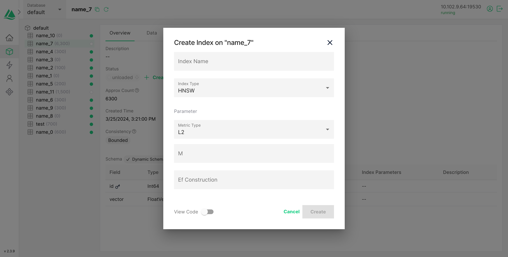
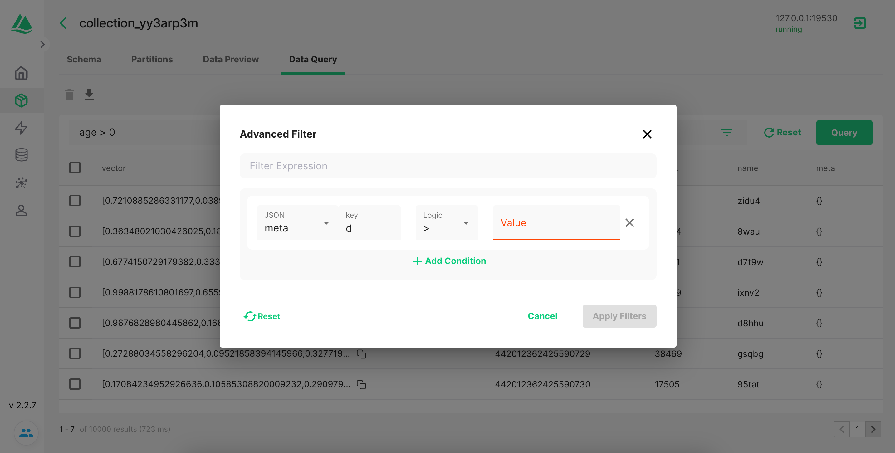

# Attu

[](https://badges.aleen42.com/src/typescript.svg)
[](https://img.shields.io/docker/pulls/zilliz/attu)
[](https://codecov.io/gh/zilliztech/attu)

Attu provides an intuitive and efficient GUI for Milvus v2, allowing you to interact with your databases and manage your data with just few clicks.

## screenshots







## Features

Attu is under rapid development and we are adding new features weekly, here are the current plan, we will release a version once a feature is available.

- Manage collections/partitions
- Manage index
- Basic statistics overview
- Load/release collections for search
- Insert entities
- Vector search with advanced filter
- System view
- Data query
- View root node configuration
- Support TLS connection and username,password
- Vector Visualization(TBD)
- More...

## Quick start

### Before you start

Ensure you have Milvus installed on [your server](https://milvus.io/docs/install_standalone-docker.md) or [cluster](https://milvus.io/docs/install_cluster-docker.md), and attu only supports Milvus 2.x.

### ⭐️ Start a attu instance

**_ Before attu v2.1.0 , [check here](https://github.com/zilliztech/attu/tree/v2.0.5) _**

```code
docker run -p 8000:3000 -e MILVUS_URL={milvus server ip}:19530 zilliz/attu:latest
```

Once you start the docker, open the browser, type `http://{ attu ip }:8000`, you can view the attu.

#### Params

| Parameter  | Example           | required | description                 |
| :--------- | :---------------- | :------: | --------------------------- |
| MILVUS_URL | 192.168.0.1:19530 |  false   | Optional, Milvus server URL |

Tip: **127.0.0.1 or localhost will not work when runs on docker**

#### Try the dev build

**_note_** We plan to release attu once a feature is done. Also, if you want to try the nightly build, please pull the docker image with the `dev` tag.

```code
docker run -p 8000:3000 -e MILVUS_URL={ your machine IP }:19530 zilliz/attu:dev
```

## ✨ Contributing Code

You might want to build Attu locally to contribute some code, test out the latest features, or try
out an open PR:

### Build server

1. Fork and clone the repo
2. `cd server` go to the server directory
3. `yarn install` to install dependencies
4. Create a branch for your PR

### Build client

1. Fork and clone the repo
2. `cd client` go to the client directory
3. `yarn install` to install dependencies
4. Create a branch for your PR

### Milvus

New to milvus? [Milvus](https://milvus.io) is an open-source vector database built to power AI applications and embedding similarity search.

### Userful links

- [Milvus docs](https://milvus.io/docs)
- [Milvus python sdk](https://github.com/milvus-io/pymilvus)
- [Milvus java sdk](https://github.com/milvus-io/milvus-sdk-java)
- [Milvus gp sdk](https://github.com/milvus-io/milvus-sdk-go)
- [Milvus node sdk](https://github.com/milvus-io/milvus-sdk-node)
- [Feder](https://github.com/zilliztech/feder)

#### ❓ Questions? Problems?

- If you've found a bug or want to request a feature, please create a [GitHub Issue](https://github.com/zilliztech/attu/issues/new/choose).
  Please check to make sure someone else hasn't already created an issue for the same topic.

[milvus-doc]: https://milvus.io/docs

## Community

💬 Community isn’t just about writing code together. Come join the conversation, share your knowledge and get your questions answered on [Milvus Slack Channel](https://join.slack.com/t/milvusio/shared_invite/zt-e0u4qu3k-bI2GDNys3ZqX1YCJ9OM~GQ)!

<a href="https://join.slack.com/t/milvusio/shared_invite/zt-e0u4qu3k-bI2GDNys3ZqX1YCJ9OM~GQ">
    
</a>
