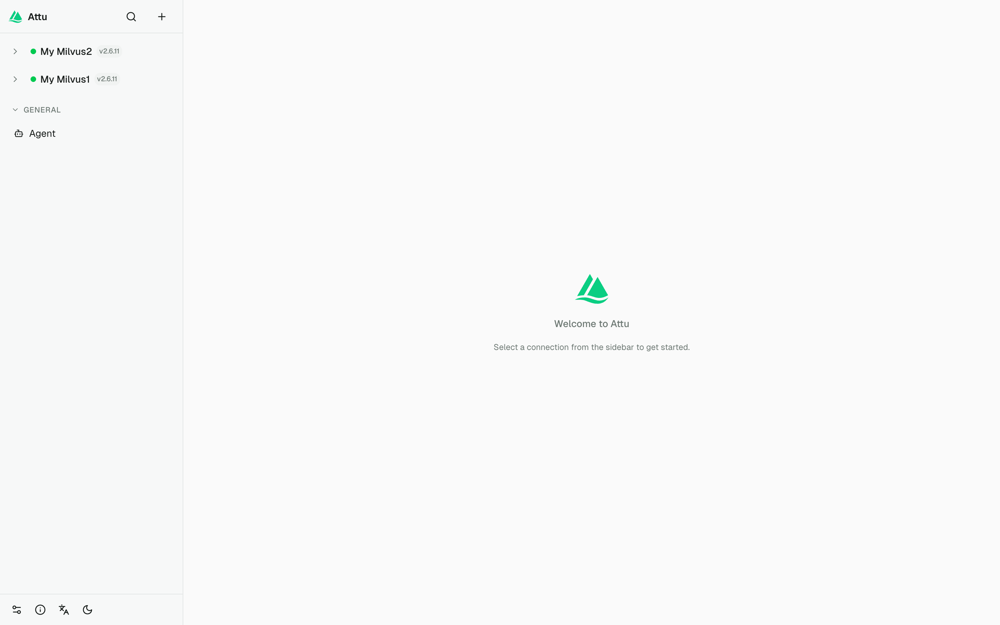
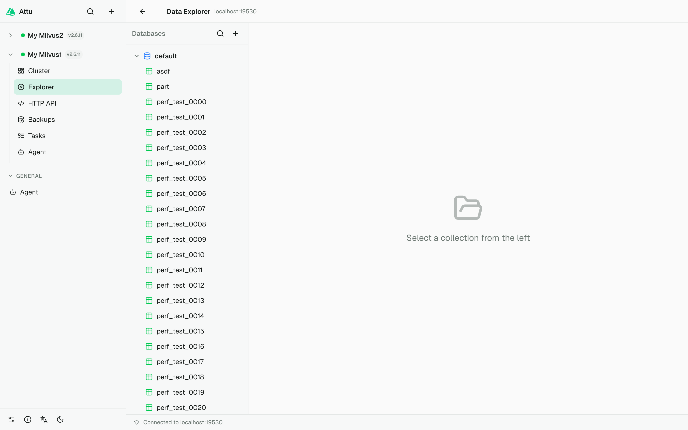
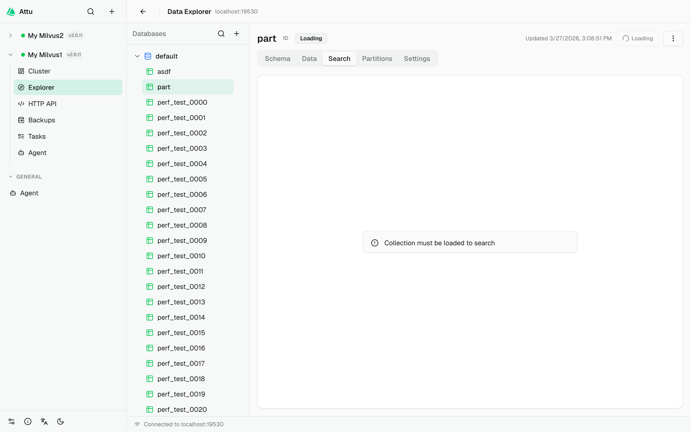
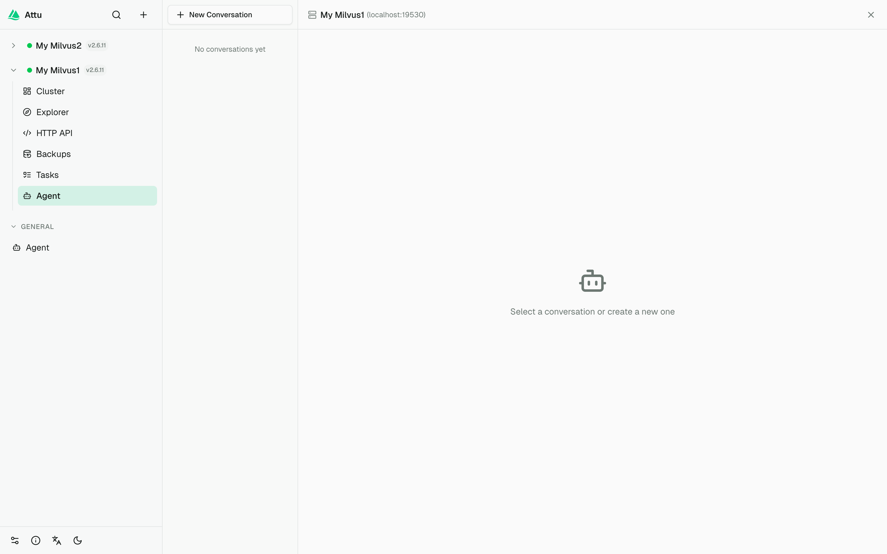
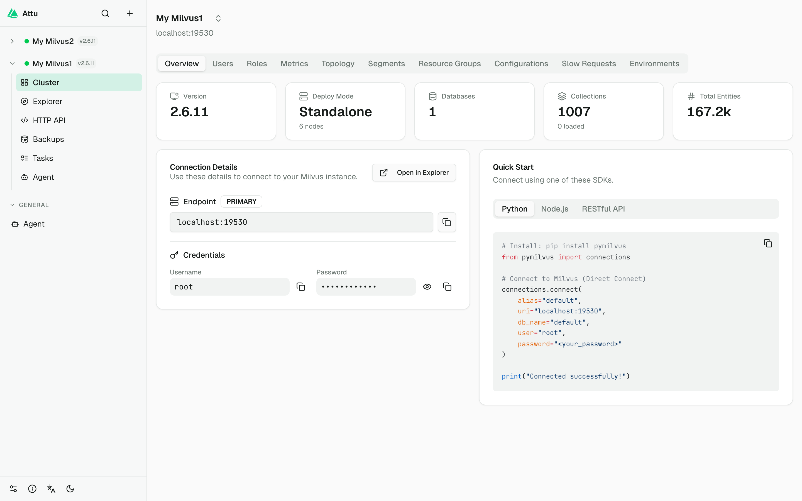
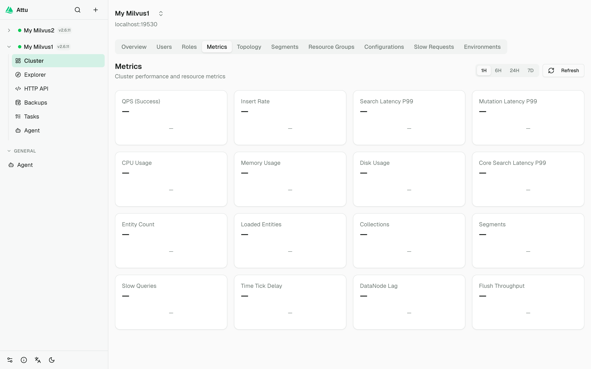
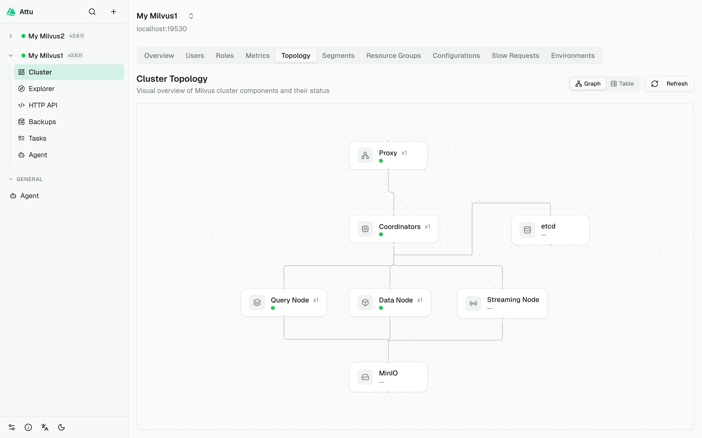
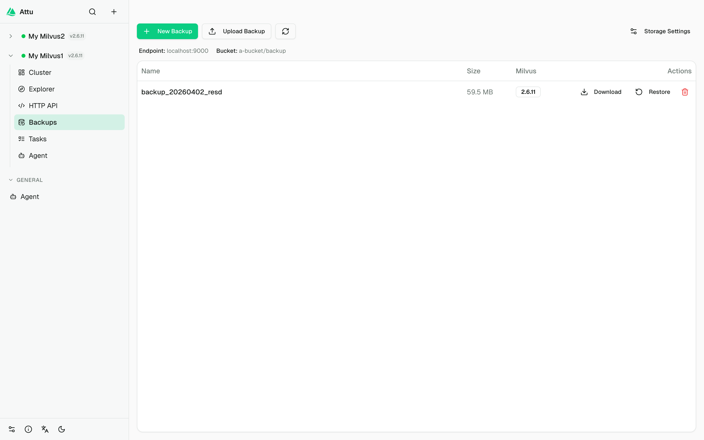
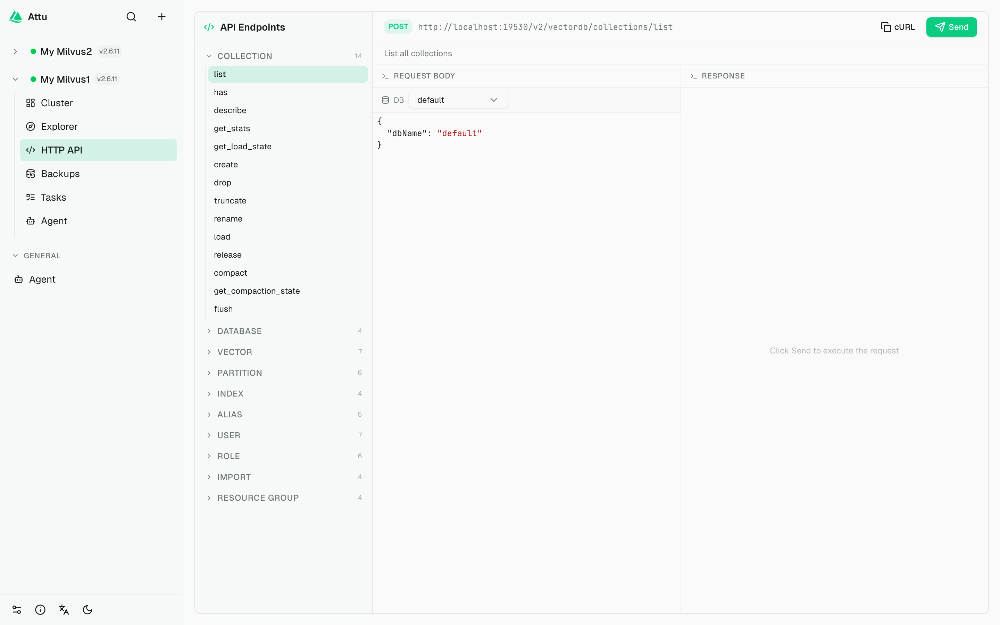

# Attu — The AI Workbench for Milvus


[](https://hub.docker.com/r/zilliz/attu/tags)

[](./README_CN.md)

Attu is a modern, AI-native management tool for [Milvus](https://milvus.io) vector databases. Manage schemas, explore data, run vector searches, monitor clusters, and automate tasks with a built-in AI agent — all from a single interface.

Available as a **web app** (Docker / Kubernetes) or **desktop app** (macOS, Linux, Windows).



---

## What's New in v3

Attu v3 is a ground-up rewrite with a modern full-stack architecture (React 19, TanStack Start, Vite).

- **AI Agent** — Chat-driven Milvus management with 50+ tools. Supports OpenAI, Anthropic, DeepSeek, Google Gemini, and custom endpoints.
- **REST API Playground** — Interactive API editor with collection-scoped context.
- **Backup & Restore** — Full and incremental backups with S3, MinIO, GCS, and Azure Blob support.
- **Prometheus Metrics Dashboard** — 16+ real-time metrics with sparkline visualizations.
- **Cluster Topology** — Interactive node visualization powered by ReactFlow.
- **Slow Request Analysis** — Identify and diagnose slow queries across nodes.
- **Desktop App with Auto-Update** — Native Electron app with automatic update delivery.
- **Dark Mode** — Full light/dark theme support.

---

## Quick Start

### Docker (recommended)

```bash
docker run -d --name attu \
  -p 3000:3000 \
  -e MILVUS_ADDRESS=host.docker.internal:19530 \
  -v attu-data:/data \
  zilliz/attu:v3.0.0-beta.1
```

Open http://localhost:3000.

### Docker Compose (Milvus + Attu)

```yaml
services:
  milvus:
    image: milvusdb/milvus:latest
    ports:
      - "19530:19530"
      - "9091:9091"
    command: milvus run standalone
    volumes:
      - milvus-data:/var/lib/milvus

  attu:
    image: zilliz/attu:v3.0.0-beta.1
    ports:
      - "3000:3000"
    environment:
      - MILVUS_ADDRESS=milvus:19530
    volumes:
      - attu-data:/data
    depends_on:
      - milvus

volumes:
  milvus-data:
  attu-data:
```

```bash
docker compose up -d
```

### Desktop App

Download the latest release for your platform:

| Platform | Download |
|----------|----------|
| macOS (Apple Silicon) | [.dmg](https://github.com/zilliztech/attu/releases/latest) |
| Linux | [.AppImage](https://github.com/zilliztech/attu/releases/latest) / [.deb](https://github.com/zilliztech/attu/releases/latest) |
| Windows | [.exe](https://github.com/zilliztech/attu/releases/latest) |

> **macOS note:** If you see "attu.app is damaged and cannot be opened", run:
> ```bash
> sudo xattr -rd com.apple.quarantine /Applications/Attu.app
> ```

---

## Features

### Data Explorer

Browse databases and collections, view and edit data inline, import/export in CSV, JSON, and Parquet formats.



### Vector Search

Interactive vector similarity search with configurable embedding providers (OpenAI, Cohere, Jina, VoyageAI, and more).



### AI Agent

Chat-driven Milvus management with 50+ tools. Create collections, run queries, manage users, analyze performance — all through natural language.

Supports: OpenAI, Anthropic Claude, DeepSeek, Google Gemini, OpenRouter, and custom API endpoints.



### Cluster Overview & Monitoring

Real-time cluster health, Prometheus metrics dashboard with 16+ metrics, and interactive topology visualization.







### Backup & Restore

Full and incremental backups with support for S3, MinIO, GCS, and Azure Blob Storage. Download backups as ZIP or restore from uploaded archives.



### REST API Playground

Interactive API testing environment scoped to your connection, database, and collection.



### And More

- **RBAC Management** — Create and manage users, roles, and privilege groups.
- **Resource Groups** — Configure resource allocation across nodes.
- **Slow Request Analysis** — Identify bottlenecks with cluster-wide slow query inspection.
- **Configuration & Environment Viewer** — Inspect runtime configs and environment variables.
- **Task Queue** — Monitor background operations (imports, backups, compactions).
- **Internationalization** — English and Chinese language support.

---

## Deployment

### Environment Variables

| Variable | Example | Description |
|----------|---------|-------------|
| `MILVUS_ADDRESS` | `milvus:19530` | Milvus gRPC endpoint |
| `MILVUS_NAME` | `My Cluster` | Display name in the connection list |
| `MILVUS_DATABASE` | `default` | Default database |
| `MILVUS_USERNAME` | `root` | Auth username |
| `MILVUS_PASSWORD` | `milvus` | Auth password |
| `MILVUS_TOKEN` | `token` | Auth token (alternative to username/password) |
| `MILVUS_SSL` | `true` | Enable TLS connection |
| `PORT` | `3000` | Server listen port (default: 3000) |
| `ATTU_DB_PATH` | `/data/attu.db` | SQLite database path for connections and preferences |

When `MILVUS_ADDRESS` is set, Attu will automatically create a connection on first launch.

> **Note:** `MILVUS_ADDRESS` must be reachable from the Attu container. `127.0.0.1` or `localhost` will not work — use the container/service name or `host.docker.internal`.

### TLS / SSL

Mount your certificate files and set the corresponding environment variables:

```bash
docker run -d --name attu \
  -p 3000:3000 \
  -v /path/to/certs:/certs \
  -e MILVUS_ADDRESS=milvus:19530 \
  -e MILVUS_SSL=true \
  zilliz/attu:v3.0.0-beta.1
```

### Kubernetes

```bash
kubectl apply -f https://raw.githubusercontent.com/zilliztech/attu/main/deploy/attu-k8s-deploy.yaml
```

Edit the YAML to set `MILVUS_ADDRESS` to your Milvus service name (e.g., `my-release-milvus:19530`).

### Nginx Reverse Proxy

See the [nginx deployment guide](https://github.com/zilliztech/attu/tree/main/deploy/nginx).

---

## Compatibility

| Milvus Version | Attu Version |
|----------------|-------------|
| 2.5.x – 2.6.x | [v3.0.0-beta.1](https://github.com/zilliztech/attu/releases/tag/v3.0.0-beta.1) |
| 2.6.x | [v2.6.5](https://github.com/zilliztech/attu/releases/tag/v2.6.5) |
| 2.5.x | [v2.5.10](https://github.com/zilliztech/attu/releases/tag/v2.5.10) |
| 2.4.x | [v2.4.12](https://github.com/zilliztech/attu/releases/tag/v2.4.12) |
| 2.3.x | [v2.3.5](https://github.com/zilliztech/attu/releases/tag/v2.3.5) |

---

## FAQ

**I can't connect to Milvus from Docker**
> Make sure `MILVUS_ADDRESS` is reachable from inside the container. Use the Docker service name, not `localhost`. See [#161](https://github.com/zilliztech/attu/issues/161).

**macOS says the app is damaged**
> Run `sudo xattr -rd com.apple.quarantine /Applications/Attu.app` in Terminal.

**How do I update?**
> Docker: pull the latest image and restart. Desktop: the app checks for updates automatically on launch.

---

## Resources

- [Milvus Documentation](https://milvus.io/docs)
- [Milvus Python SDK](https://github.com/milvus-io/pymilvus)
- [Milvus Java SDK](https://github.com/milvus-io/milvus-sdk-java)
- [Milvus Go SDK](https://github.com/milvus-io/milvus-sdk-go)
- [Milvus Node.js SDK](https://github.com/milvus-io/milvus-sdk-node)

## Community

Join the [Milvus Discord](https://discord.com/invite/8uyFbECzPX) to ask questions, share feedback, and connect with other users.

## License

Attu was open source under the Apache License 2.0 through version v2.5.12. Starting from version v2.6.0, Attu is proprietary software. See [LICENSE_PROPRIETARY.txt](./LICENSE_PROPRIETARY.txt) for details.
