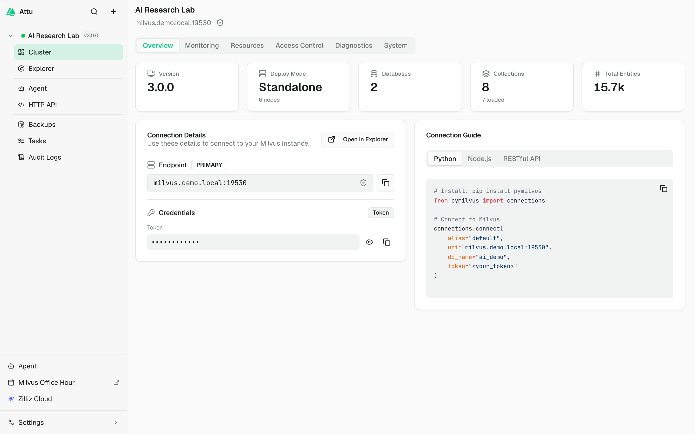
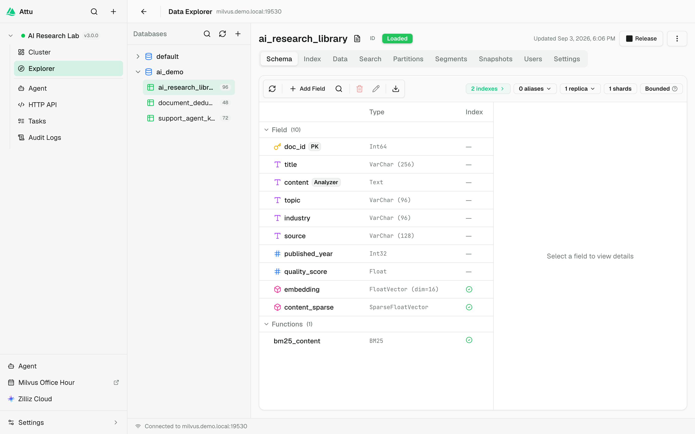
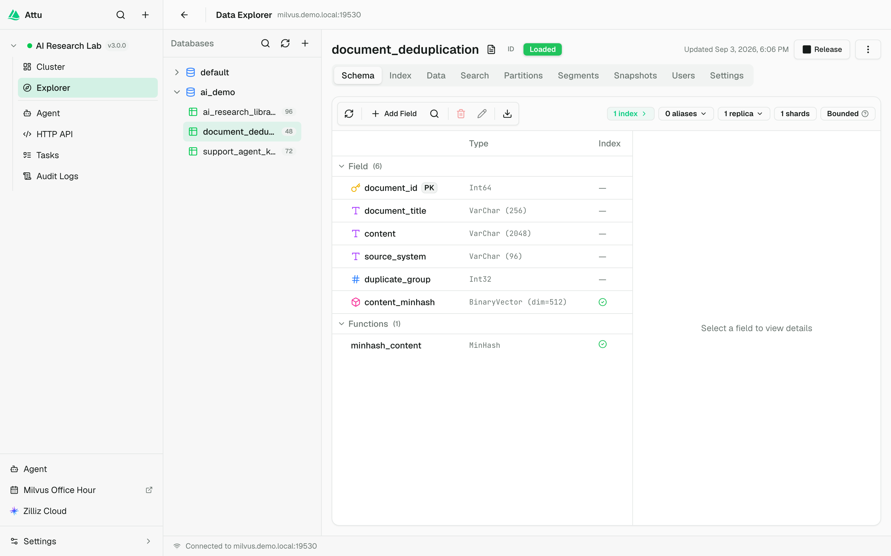
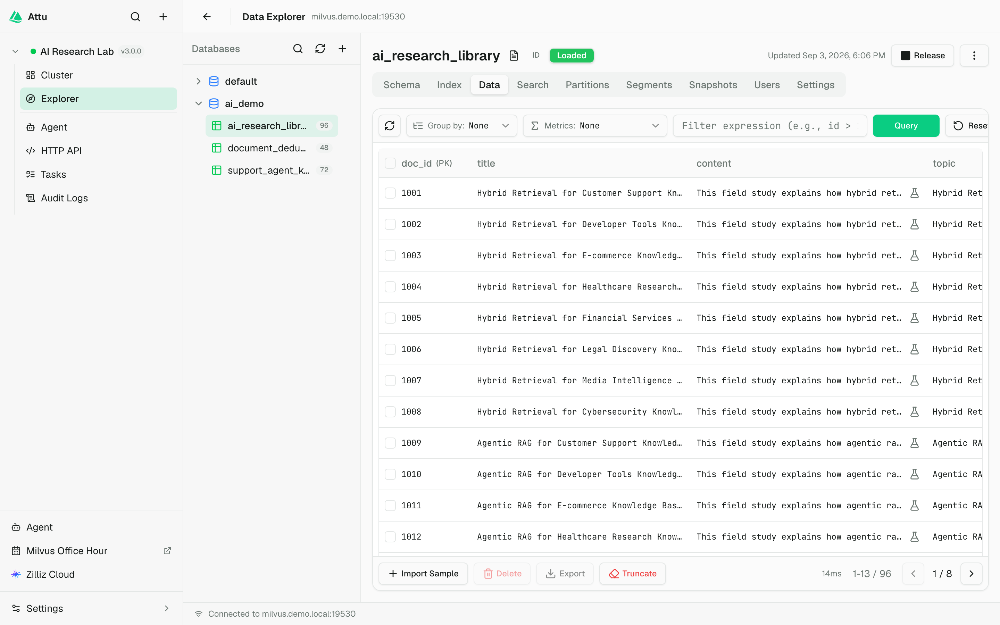
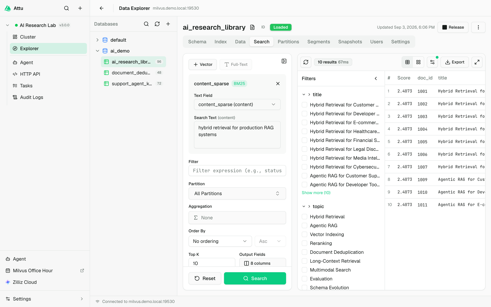
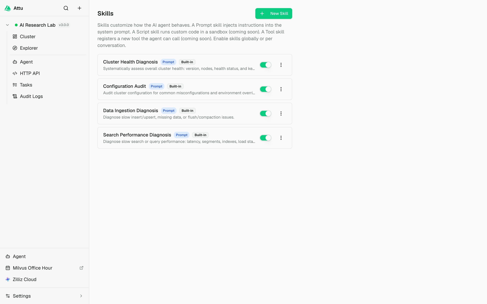
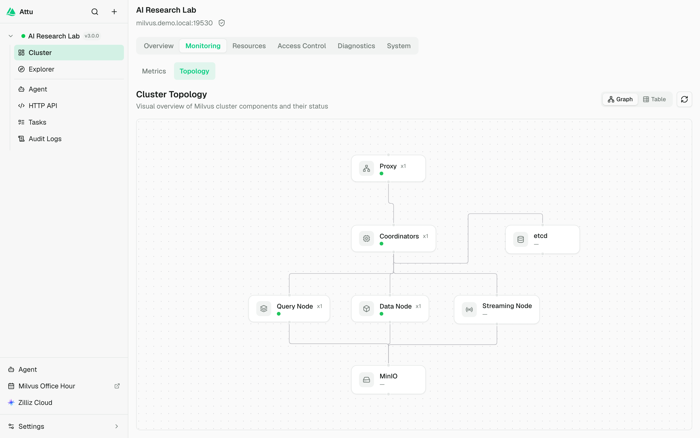
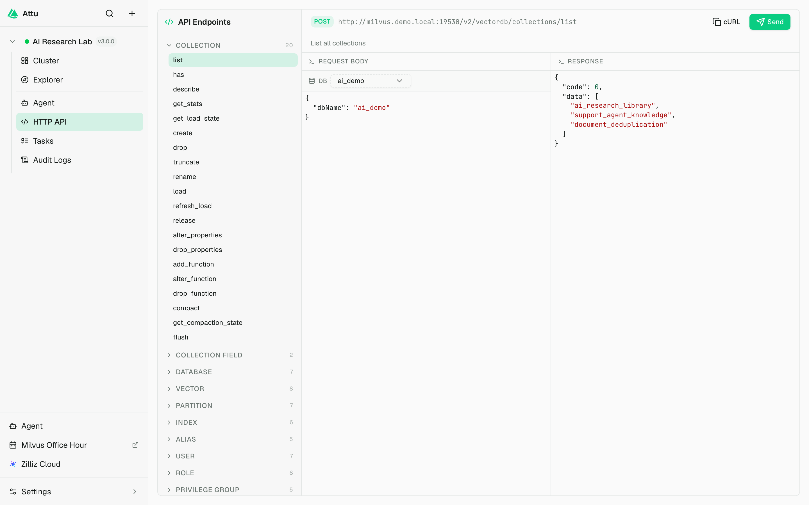

# Attu - The AI Workbench for Milvus


[](https://hub.docker.com/r/zilliz/attu/tags)

[](./README_CN.md)

Attu is an AI-native management tool for [Milvus](https://milvus.io) vector databases. Connect to multiple Milvus clusters from a single instance, browse collections, run vector searches, manage backups, monitor health, and chat with an AI agent that understands your data.

Available as a **web app** (Docker, Kubernetes, or a standalone server package) or **desktop app** (macOS, Linux, Windows).



---

## What's New in v3.0

Attu 3.0 expands the visual experience for Milvus 3.0 while retaining compatibility with Milvus 2.6.0+ and Zilliz Cloud. Highlights include:

- **External Collections and Snapshots** - Explore Parquet and Iceberg data without copying it into Milvus, refresh external schemas and data, and browse or restore Collection Snapshots.
- **Text and Schema Evolution** - Work with Milvus `TEXT` fields, add or remove supported fields, edit descriptions, and manage Function Fields from the Schema page.
- **Search and Analytics** - Run Query and Search aggregations, group and order results, paginate large result sets, and apply Function Score reranking.
- **MinHash Deduplication** - Configure MinHash Function Fields and `MINHASH_LSH` indexes to find near-duplicate documents from raw text.
- **Analyzers and File Resources** - Register reusable dictionaries, stop-word lists, synonym lists, and tokenizer resources.
- **Collection and Data Management** - Load or release individual partitions, configure entity-level TTL, export complete Collections, and import large files in chunks.

<p align="center">
  
  
</p>

See the [Attu v3.0.0 release notes](https://github.com/zilliztech/attu/releases/tag/v3.0.0) for details.

---

## Quick Start

### Docker (recommended)

```bash
docker run -d --name attu \
  -p 3000:3000 \
  -e MILVUS_ADDRESS=host.docker.internal:19530 \
  -v attu-data:/data \
  zilliz/attu:v3.0.0
```

Open http://localhost:3000 and connect to Zilliz Cloud or an open-source Milvus 2.6.0+ or 3.x instance.

The Docker image stores its SQLite database at `/data/attu.db` by default. The `-v attu-data:/data` volume persists your saved connections, agent conversations, and preferences across container restarts.

The image runs as the non-root `node` user (`uid=1000`, `gid=1000`), so named volumes are recommended. If you use a host bind mount such as `./attu-data:/data`, prepare the directory before starting Attu:

```bash
mkdir -p ./attu-data
sudo chown -R 1000:1000 ./attu-data
```

On SELinux-enabled hosts, also add the `:Z` mount option: `./attu-data:/data:Z`.

### Docker Compose (Milvus + Attu)

```yaml
services:
  milvus:
    # Use a supported Milvus 2.6.x or 3.x image.
    image: milvusdb/milvus:<supported-tag>
    ports:
      - "19530:19530"
      - "9091:9091"
    command: milvus run standalone
    volumes:
      - milvus-data:/var/lib/milvus

  attu:
    image: zilliz/attu:v3.0.0
    ports:
      - "3000:3000"
    environment:
      - MILVUS_ADDRESS=milvus:19530
    volumes:
      - attu-data:/data
    depends_on:
      - milvus

volumes:
  milvus-data:
  attu-data:
```

```bash
docker compose up -d
```

Attu v3.0 supports Zilliz Cloud and open-source Milvus 2.6.0+ and 3.x. Milvus 2.5.x and earlier are not supported.

### Desktop App

Download the latest release for your platform:

| Platform | Download |
|----------|----------|
| macOS (Apple Silicon) | [.dmg](https://github.com/zilliztech/attu/releases/latest) |
| Linux | [.AppImage](https://github.com/zilliztech/attu/releases/latest) / [.deb](https://github.com/zilliztech/attu/releases/latest) |
| Windows | [.exe](https://github.com/zilliztech/attu/releases/latest) |

> **macOS note:** If you see "attu.app is damaged and cannot be opened", run:
> ```bash
> sudo xattr -rd com.apple.quarantine /Applications/Attu.app
> ```

### Standalone Server Package

The v3.0.0 release includes a non-Docker, non-Electron server package for Linux x64. It requires Node.js 24.x and includes the Attu server bundle and `bin/milvus-backup`.

```bash
curl -LO https://github.com/zilliztech/attu/releases/download/v3.0.0/attu-server-3.0.0-linux-x64-node24.tar.gz
tar -xzf attu-server-3.0.0-linux-x64-node24.tar.gz
cd attu-server-3.0.0-linux-x64-node24
./bin/attu-server
```

Open <http://localhost:3080>. The launcher defaults to `0.0.0.0:3080`. Set `HOST`, `PORT`, `ATTU_DATA_DIR`, or `ATTU_DB_PATH` to customize the runtime paths and listener.

---

## Features

### Multi-Cluster Management

Connect to multiple Milvus instances from a single Attu deployment. Add, edit, and switch between connections in the sidebar. Each cluster has its own dedicated workspace with independent monitoring, agent sessions, and preferences, ideal for managing dev, staging, and production environments side by side.

### Data Explorer

Browse databases and collections, view and edit data inline, import/export in CSV, JSON, and Parquet formats.



### Vector Search

Interactive vector similarity search with configurable embedding providers (OpenAI, Cohere, Jina, VoyageAI, and more).



### AI Agent

Chat-driven Milvus management with 50+ tools. Create collections, run queries, manage users, and analyze performance through natural language.

Supports: OpenAI, Anthropic Claude, DeepSeek, Google Gemini, OpenRouter, and custom API endpoints.



### Cluster Overview & Monitoring

Real-time cluster health, Prometheus metrics dashboard with 16+ metrics, and interactive topology visualization.



### Backup & Restore

Full and incremental backups with support for S3, MinIO, GCS, and Azure Blob Storage. Download backups as ZIP or restore from uploaded archives.

### REST API Playground

Interactive API testing environment scoped to your connection, database, and collection.



### And More

- **RBAC Management** - Create and manage users, roles, and privilege groups.
- **Resource Groups** - Configure resource allocation across nodes.
- **Slow Request Analysis** - Identify bottlenecks with cluster-wide slow query inspection.
- **Configuration & Environment Viewer** - Inspect runtime configs and environment variables.
- **Task Queue** - Monitor background operations for imports, exports, backups, restores, and copy jobs.
- **Audit Logs** - Review write operations initiated from the Attu UI or server functions.
- **Internationalization** - English and Chinese language support.

---

## Deployment

### Runtime Configuration

| Variable | Required | Default | Description |
|----------|----------|---------|-------------|
| `ATTU_DB_PATH` | No | Docker: `/data/attu.db`; server: `attu.db` | SQLite database path for Attu app data |
| `ATTU_AUDIT_RETENTION_DAYS` | No | `90` | Audit log retention in days; `0` or less disables pruning |
| `LOG_LEVEL` | No | `info` | Server log level supported by Pino |
| `MILVUS_GRPC_TIMEOUT` | No | `15000` | Milvus gRPC request timeout in milliseconds |

### Pre-configured Connection

Set `MILVUS_ADDRESS` to automatically create a default connection on startup. This is useful for Kubernetes and Docker Compose deployments where Attu is co-deployed with Milvus.

```bash
docker run -d \
  --name attu \
  -p 3000:3000 \
  -v attu-data:/data \
  -e MILVUS_ADDRESS=milvus:19530 \
  zilliz/attu:v3.0.0
```

| Variable | Required | Default | Description |
|----------|----------|---------|-------------|
| `MILVUS_ADDRESS` | Yes | - | Milvus gRPC endpoint, for example `milvus:19530` |
| `MILVUS_NAME` | No | Same as address | Display name shown in the connection list |
| `MILVUS_DATABASE` | No | `default` | Target database |
| `MILVUS_TOKEN` | No | - | Auth token; use a Kubernetes Secret for sensitive values |
| `MILVUS_USERNAME` | No | - | Username |
| `MILVUS_PASSWORD` | No | - | Password; use a Kubernetes Secret for sensitive values |
| `MILVUS_SSL` | No | `false` | Set to `true` to enable TLS |
| `MILVUS_TLS_ROOT_CERT_PATH` | No | - | CA/root certificate path for TLS |
| `MILVUS_TLS_PRIVATE_KEY_PATH` | No | - | Client private key path for mutual TLS |
| `MILVUS_TLS_CERT_CHAIN_PATH` | No | - | Client certificate chain path for mutual TLS |
| `MILVUS_TLS_ROOT_CERT` | No | - | Inline CA/root certificate PEM stored in the connection record |
| `MILVUS_TLS_PRIVATE_KEY` | No | - | Inline client private key PEM stored in the connection record |
| `MILVUS_TLS_CERT_CHAIN` | No | - | Inline client certificate chain PEM stored in the connection record |
| `MILVUS_TLS_SERVER_NAME` | No | - | Override TLS verification/SNI server name |
| `MILVUS_TLS_SKIP_CERT_CHECK` | No | `false` | Skip certificate verification; insecure and for testing only |

`MILVUS_SSL` is enabled automatically when any `MILVUS_TLS_*` certificate, server name, or skip-check variable is set.

`MILVUS_ADDRESS` must be reachable from the Attu container. `127.0.0.1` or `localhost` usually points to the container itself, so use a Docker service name, Kubernetes service name, or `host.docker.internal`.

### Local Login

Attu server deployments run with local login enabled by default. The first visit shows a one-time setup form for creating the first admin account. Desktop/Electron builds run in single-user mode and do not support Attu multi-user login.

```bash
ATTU_ADMIN_USER=admin \
ATTU_ADMIN_PASSWORD='Change-me-please-123' \
pnpm --filter @attu/app dev --host 127.0.0.1
```

Set `ATTU_AUTH_MODE=none` to keep a server deployment in single-user mode. This is intended for local development or deployments protected by another access layer.

If the only admin password is lost, restart Attu once with a recovery password:

```bash
ATTU_ADMIN_RESET_USER=admin \
ATTU_ADMIN_RESET_PASSWORD='New-change-me-123' \
pnpm --filter @attu/app start
```

When exactly one active admin exists, `ATTU_ADMIN_RESET_USER` can be omitted. Remove the reset variables after signing in because Attu applies them on startup and clears existing sessions for that admin.

| Variable | Required | Description |
|----------|----------|-------------|
| `ATTU_RUNTIME` | No | Set to `desktop` to force single-user mode. Electron sets this automatically. Server/Docker deployments should leave it unset. |
| `ATTU_AUTH_MODE` | No | Server override: `local` enables Attu login; `none` disables it. Defaults to `local` for server/Docker and `none` for desktop. |
| `ATTU_AUTH_ENABLED` | No | Legacy boolean alias. `true` maps to `ATTU_AUTH_MODE=local`; `false` maps to `none`. |
| `ATTU_ADMIN_USER` | Optional | Bootstrap admin username or email created on startup when no users exist. |
| `ATTU_ADMIN_PASSWORD` | Optional | Bootstrap admin password. Must be set with `ATTU_ADMIN_USER` to create the bootstrap admin. |
| `ATTU_ADMIN_EMAIL` | No | Optional email stored on the bootstrap admin. |
| `ATTU_ADMIN_NAME` | No | Optional display name for the bootstrap admin. Defaults to `ATTU_ADMIN_USER`. |
| `ATTU_ADMIN_RESET_USER` | No | Existing local admin username or email to reset. Required when more than one active admin exists. |
| `ATTU_ADMIN_RESET_PASSWORD` | Optional | One-time startup password reset for the selected local admin. Must satisfy the password policy. Remove after recovery. |
| `ATTU_AUTH_SESSION_DAYS` | No | Session lifetime in days. Defaults to `30`. |
| `ATTU_SESSION_DAYS` | No | Legacy alias for `ATTU_AUTH_SESSION_DAYS`. |
| `ATTU_AUTH_COOKIE_SECURE` | No | Overrides session cookie `Secure`. By default Attu enables it for HTTPS or `X-Forwarded-Proto: https`; set `false` only for local HTTP testing. |

### Audit Logs

Attu records audit logs for write operations initiated from the Attu UI or server functions. These logs are stored in Attu's SQLite database and are separate from Milvus native logs. Read-only browsing, search, and query operations are not audited.

Audited actions include connection management, database and collection management, schema and metadata changes, data writes, index and partition operations, user and role administration, resource group changes, AI configuration changes, and import/export/backup/restore task starts.

Each audit record includes the connection, actor, action, resource type/name, database name, success/failure status, error message, metadata, and timestamp. Sensitive metadata fields are redacted before storage when their key contains values such as `password`, `token`, `secret`, `apiKey`, `privateKey`, `cert`, `certificate`, or `credential`.

Audit retention defaults to 90 days. Set `ATTU_AUDIT_RETENTION_DAYS` to change the retention window; set it to `0` or a negative value to disable automatic pruning.

### TLS / SSL

Attu supports one-way TLS and mutual TLS (mTLS) for Milvus gRPC connections.

- **One-way TLS**: Attu verifies the Milvus server certificate. A custom CA/root certificate is optional.
- **Mutual TLS (mTLS)**: Attu verifies the Milvus server certificate and sends a client certificate/key to Milvus.
- **Server name override**: Set `MILVUS_TLS_SERVER_NAME` or the UI field when the certificate hostname differs from the address host.
- **Skip certificate verification**: `MILVUS_TLS_SKIP_CERT_CHECK=true` is insecure and intended only for local testing. It is not supported with mTLS.

You can configure TLS certificates in the Attu UI by uploading PEM files or by entering paths readable by the Attu server/container. Uploaded PEM content is stored in Attu's SQLite connection record, so Docker and Kubernetes deployments do not need certificate volume mounts for that flow.

One-way TLS with mounted certificate paths:

```bash
docker run -d \
  --name attu \
  -p 3000:3000 \
  -v attu-data:/data \
  -v "$PWD/certs:/etc/attu/certs:ro" \
  -e MILVUS_ADDRESS=milvus.example.com:19530 \
  -e MILVUS_SSL=true \
  -e MILVUS_TLS_ROOT_CERT_PATH=/etc/attu/certs/ca.pem \
  -e MILVUS_TLS_SERVER_NAME=milvus.example.com \
  zilliz/attu:v3.0.0
```

Mutual TLS with mounted certificate paths:

```bash
docker run -d \
  --name attu \
  -p 3000:3000 \
  -v attu-data:/data \
  -v "$PWD/certs:/etc/attu/certs:ro" \
  -e MILVUS_ADDRESS=milvus.example.com:19530 \
  -e MILVUS_SSL=true \
  -e MILVUS_TLS_ROOT_CERT_PATH=/etc/attu/certs/ca.pem \
  -e MILVUS_TLS_PRIVATE_KEY_PATH=/etc/attu/certs/client.key \
  -e MILVUS_TLS_CERT_CHAIN_PATH=/etc/attu/certs/client.pem \
  -e MILVUS_TLS_SERVER_NAME=milvus.example.com \
  zilliz/attu:v3.0.0
```

See [Run Attu with local Milvus mutual TLS in Docker](./docs/milvus-mtls-local-docker.md) for a complete local mTLS setup, including certificate generation, Milvus Docker Compose configuration, and verification.

### Kubernetes

```bash
kubectl apply -f https://raw.githubusercontent.com/zilliztech/attu/main/deploy/attu-k8s-deploy.yaml
```

Edit the YAML to set `MILVUS_ADDRESS` to your Milvus service name (e.g., `my-release-milvus:19530`).

### Nginx Reverse Proxy

See the [nginx deployment guide](https://github.com/zilliztech/attu/tree/main/deploy/nginx).

---

## Compatibility

Attu v3.0 supports Zilliz Cloud and open-source Milvus 2.6.0+ and 3.x. Milvus 2.5.x and earlier are not supported.

External Collections, Snapshots, `TEXT` fields, MinHash, entity-level TTL, aggregation, ordering, and some schema operations require Milvus 3.x. Attu adapts the available actions to the connected Milvus version and configuration.

`TEXT` fields and External Collections require Storage V3. If Storage V3 is disabled, set `common.storage.useLoonFFI=true` in Milvus and restart the service. External Collection data remains read-only in Attu.

| Milvus Version | Attu Version |
|----------------|-------------|
| Zilliz Cloud | [v3.0.0](https://github.com/zilliztech/attu/releases/tag/v3.0.0) |
| 3.x | [v3.0.0](https://github.com/zilliztech/attu/releases/tag/v3.0.0) |
| 2.6.x | [v3.0.0](https://github.com/zilliztech/attu/releases/tag/v3.0.0) |
| 2.5.x | [v2.5.10](https://github.com/zilliztech/attu/releases/tag/v2.5.10) |
| 2.4.x | [v2.4.12](https://github.com/zilliztech/attu/releases/tag/v2.4.12) |
| 2.3.x | [v2.3.5](https://github.com/zilliztech/attu/releases/tag/v2.3.5) |

---

## FAQ

**I can't connect to Milvus from Docker**
> Make sure `MILVUS_ADDRESS` is reachable from inside the container. Use the Docker service name, not `localhost`. See [#161](https://github.com/zilliztech/attu/issues/161).

**macOS says the app is damaged**
> Run `sudo xattr -rd com.apple.quarantine /Applications/Attu.app` in Terminal.

**How do I update?**
> Docker: pull the latest image and restart. Desktop: the app checks for updates automatically on launch.

---

## Resources

- [Milvus Documentation](https://milvus.io/docs)
- [Milvus Python SDK](https://github.com/milvus-io/pymilvus)
- [Milvus Java SDK](https://github.com/milvus-io/milvus-sdk-java)
- [Milvus Go SDK](https://github.com/milvus-io/milvus-sdk-go)
- [Milvus Node.js SDK](https://github.com/milvus-io/milvus-sdk-node)

## Community

Join the [Milvus Discord](https://discord.com/invite/8uyFbECzPX) to ask questions, share feedback, and connect with other users.

## License

Attu was open source under the Apache License 2.0 through version v2.5.12. Starting from version v2.6.0, Attu is proprietary software. See [LICENSE_PROPRIETARY.txt](./LICENSE_PROPRIETARY.txt) for details.
