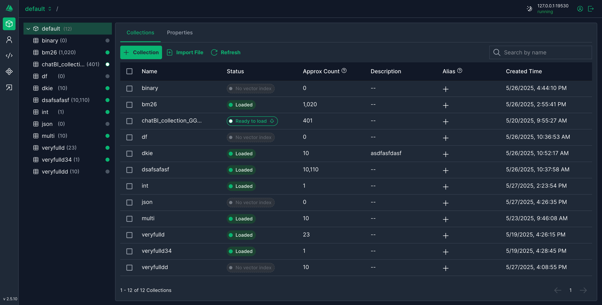
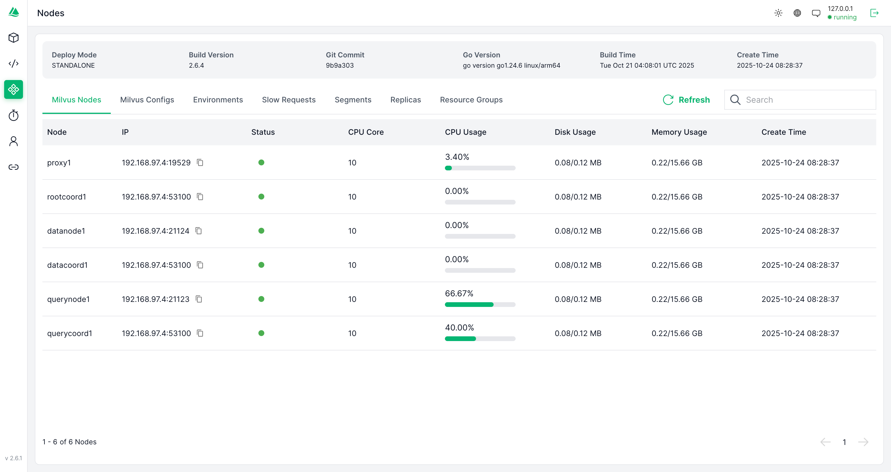

# Attu


[](https://hub.docker.com/r/zilliz/attu/tags)

[](./README_CN.md)

Attu is designed to manage and interact with Milvus, offering features such as:

- **Database, Collection, and Partition Management:** Efficiently organize and manage your Milvus setup.
- **Insertion, Indexing, and Querying of Vector Embeddings:** Easily handle Milvus vector data operations.
- **Performing Vector Search:** Rapidly validate your results using the vector search feature.
- **User and Role Management:** Easily manage Milvus permissions and security.
- **Viewing System Information:** View system configurations, monitor slow requests, and track various system tasks and performance metrics.

## Table of Contents

- [Features](#features)
- [System Requirements](#system-requirements)
- [Quick Start](#quick-start)
- [Installation Guides](#installation-guides)
  - [Compatibility](#compatibility)
  - [Running Attu from Docker](#running-attu-from-docker)
  - [Running Attu within Kubernetes](#running-attu-within-kubernetes)
  - [Running Attu behind a nginx proxy](#running-attu-behind-a-nginx-proxy)
  - [Install Desktop application](#install-desktop-application)
- [Development](#development)
- [Contributing](#contributing)
- [FAQ](#faq)
- [More Screenshots](#more-screenshots)
- [Useful Examples](#useful-examples)
- [Milvus Links](#milvus-links)
- [Community](#community)

<div style="display: flex; flex-wrap: wrap; justify-content: space-between; gap: 16px;">
  <div style="flex: 1; min-width: 300px;">
    <h4>Home View</h4>
    
  </div>
  <div style="flex: 1; min-width: 300px;">
    <h4>Data Explorer</h4>
    
  </div>
  <div style="flex: 1; min-width: 300px;">
    <h4>Collection Management</h4>
    
  </div>
  <div style="flex: 1; min-width: 300px;">
    <h4>Create Collection</h4>
    
  </div>
  <div style="flex: 1; min-width: 300px;">
    <h4>Collection Tree</h4>
    
  </div>
  <div style="flex: 1; min-width: 300px;">
    <h4>Collection Overview</h4>
    
  </div>
  <div style="flex: 1; min-width: 300px;">
    <h4>Data View</h4>
    
  </div>
  <div style="flex: 1; min-width: 300px;">
    <h4>Vector Search</h4>
    
  </div>
  <div style="flex: 1; min-width: 300px;">
    <h4>System View</h4>
    
  </div>
  <div style="flex: 1; min-width: 300px;">
    <h4>Role Chart (Light)</h4>
    
  </div>
  <div style="flex: 1; min-width: 300px;">
    <h4>Role Chart (Dark)</h4>
    
  </div>
</div>
<br />

## System Requirements

- Docker 20.10.0 or later
- Kubernetes 1.19 or later (if using K8s deployment)
- Modern web browser (Chrome, Firefox, Safari, Edge)
- For desktop application:
  - Windows 10/11
  - macOS 10.15 or later
  - Linux (Ubuntu 20.04 or later)

## Quick Start

1. Start Milvus server (if not already running):

```bash
docker run -d --name milvus_standalone -p 19530:19530 -p 9091:9091 milvusdb/milvus:latest
```

2. Start Attu:

```bash
docker run -p 8000:3000 -e MILVUS_URL=localhost:19530 zilliz/attu:v2.6
```

3. Open your browser and navigate to `http://localhost:8000`

## Installation Guides

Before you begin, make sure that you have Milvus installed on either [Zilliz Cloud](https://cloud.zilliz.com/signup) or [your own server](https://milvus.io/docs/install_standalone-docker.md).

### Compatibility

| Milvus Version | Recommended Attu Version                                           |
| -------------- | ------------------------------------------------------------------ |
| 2.6.x          | [v2.6.0](https://github.com/zilliztech/attu/releases/tag/v2.6.1)   |
| 2.5.x          | [v2.5.10](https://github.com/zilliztech/attu/releases/tag/v2.5.10) |
| 2.4.x          | [v2.4.12](https://github.com/zilliztech/attu/releases/tag/v2.4.12) |
| 2.3.x          | [v2.3.5](https://github.com/zilliztech/attu/releases/tag/v2.3.5)   |
| 2.2.x          | [v2.2.8](https://github.com/zilliztech/attu/releases/tag/v2.2.8)   |
| 2.1.x          | [v2.2.2](https://github.com/zilliztech/attu/releases/tag/v2.2.2)   |

### Running Attu from Docker

Here are the steps to start a container for running Attu:

```code
docker run -p 8000:3000 -e MILVUS_URL={milvus server IP}:19530 zilliz/attu:v2.6
```

Make sure that the Attu container can access the Milvus IP address. After starting the container, open your web browser and enter `http://{ Attu IP }:8000` to view the Attu GUI.

#### Optional Environment Variables for Running Attu Docker

| Parameter        | Example              | Required | Description                             |
| :--------------- | :------------------- | :------: | --------------------------------------- |
| MILVUS_URL       | 192.168.0.1:19530    |  false   | Optional, Milvus server URL             |
| DATABASE         | your database        |  false   | Optional, default database name         |
| ATTU_LOG_LEVEL   | info                 |  false   | Optional, sets the log level for Attu   |
| ROOT_CERT_PATH   | /path/to/root/cert   |  false   | Optional, path to the root certificate  |
| PRIVATE_KEY_PATH | /path/to/private/key |  false   | Optional, path to the private key       |
| CERT_CHAIN_PATH  | /path/to/cert/chain  |  false   | Optional, path to the certificate chain |
| SERVER_NAME      | your_server_name     |  false   | Optional, name of your server           |
| SERVER_PORT      | Server listen port   |  false   | Optional, 3000 by default if unset      |

> Please note that the `MILVUS_URL` should be an address that the Attu Docker container can access. Therefore, "127.0.0.1" or "localhost" will not work.

To run the Docker container with these environment variables, use the following command:

#### Attu SSL Example

```bash
docker run -p 8000:3000 \
-v /your-tls-file-path:/app/tls \
-e ATTU_LOG_LEVEL=info  \
-e ROOT_CERT_PATH=/app/tls/ca.pem \
-e PRIVATE_KEY_PATH=/app/tls/client.key \
-e CERT_CHAIN_PATH=/app/tls/client.pem \
-e SERVER_NAME=your_server_name \
zilliz/attu:v2.6
```

#### Custom Server Port Example

_This command lets you run the docker container with host networking, specifying a custom port for
the server to listen on_

```bash
docker run --network host \
-v /your-tls-file-path:/app/tls \
-e ATTU_LOG_LEVEL=info  \
-e SERVER_NAME=your_server_name \
-e SERVER_PORT=8080 \
zilliz/attu:v2.6
```

### Running Attu within Kubernetes

Before you begin, make sure that you have Milvus installed and running within your [K8's Cluster](https://milvus.io/docs/install_cluster-milvusoperator.md). Note that Attu only supports Milvus 2.x.

Here are the steps to start a container for running Attu:

```code
kubectl apply -f https://raw.githubusercontent.com/zilliztech/attu/main/attu-k8s-deploy.yaml
```

Make sure that the Attu pod can access the Milvus service. In the example provided this connects directly to `my-release-milvus:19530`. Change this based on the Milvus service name. A more flexible way to achieve this would be to introduce a `ConfigMap`. See this [example]("https://raw.githubusercontent.com/zilliztech/attu/main/examples/attu-k8s-deploy-ConfigMap.yaml") for details.

### Running Attu behind a nginx proxy

[Running Attu behind a nginx proxy](https://github.com/zilliztech/attu/blob/main/doc/use-attu-behind-proxy.md)

### Install Desktop application

If you prefer to use a desktop application, you can download the [desktop version of Attu](https://github.com/zilliztech/attu/releases/).

> Note:
>
> - Mac M chip install app failed: attu.app is damaged and cannot be opened.

```shell
  sudo xattr -rd com.apple.quarantine /Applications/attu.app
```

## FAQ

- I can't log into the system
  > Make sure that the IP address of the Milvus server can be accessed from the Attu container. [#161](https://github.com/zilliztech/attu/issues/161)
- If you encounter issues installing the desktop app on Mac OS, refer to the note under [Install Desktop application](#install-desktop-application).
- How to update Attu?
  > For Docker users, simply pull the latest image and restart the container. For desktop users, download the latest release from our [releases page](https://github.com/zilliztech/attu/releases).
- How to backup my Attu configuration?
  > Attu configurations are stored in your browser's local storage. You can export them from the settings page.

### Milvus links

Here are some helpful resources to get you started with Milvus:

- [Milvus documentation](https://milvus.io/docs): Here, you can find detailed information on how to use Milvus, including installation instructions, tutorials, and API documentation.
- [Milvus python SDK](https://github.com/milvus-io/pymilvus): The Python SDK allows you to interact with Milvus using Python. It provides a simple and intuitive interface for creating and querying vectors.
- [Milvus Java SDK](https://github.com/milvus-io/milvus-sdk-java): The Java SDK is similar to the Python SDK but designed for Java developers. It also provides a simple and intuitive interface for creating and querying vectors.
- [Milvus Go SDK](https://github.com/milvus-io/milvus-sdk-go): The Go SDK provides a Go API for Milvus. If you're a Go developer, this is the SDK for you.
- [Milvus Node SDK](https://github.com/milvus-io/milvus-sdk-node): The Node SDK provides a Node.js API for Milvus. If you're a Node.js developer, this is the SDK for you.
- [Feder](https://github.com/zilliztech/feder): Feder is a JavaScript tool designed to aid in the comprehension of embedding vectors.

## Community

💬 Join our vibrant community on the Milvus Discord where you can share your knowledge, ask questions and engage in meaningful conversations. It's not just about coding, it's about connecting with other like-minded individuals. Click the link below to join now!

<a href="https://discord.com/invite/8uyFbECzPX"></a>

## License

Attu was open source under the Apache License 2.0 up to version v2.5.12.
Starting from version v2.6.0, Attu is no longer open source.
