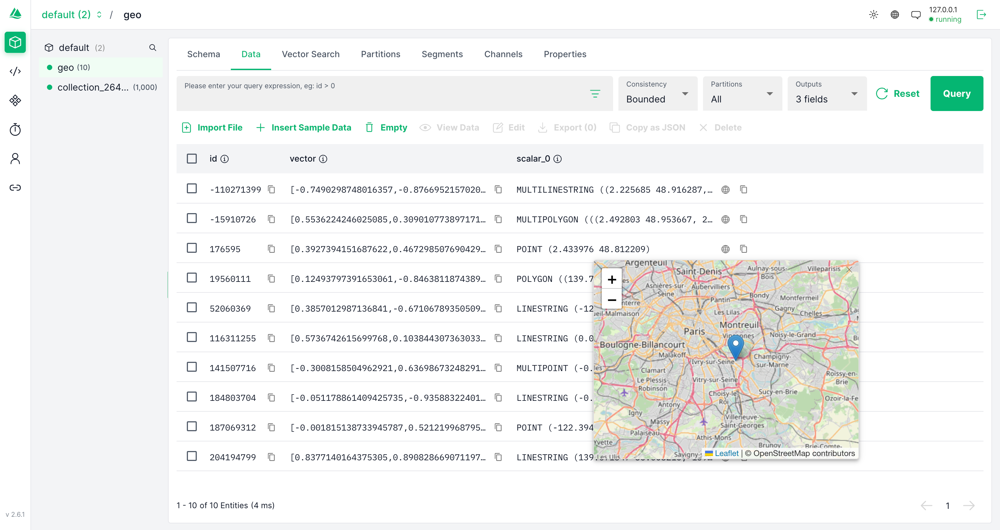

# Attu

[](https://badges.aleen42.com/src/typescript.svg)
[](https://img.shields.io/docker/pulls/zilliz/attu)

Attu is an all-in-one milvus administration tool. With Attu, you can dramatically reduce the cost of managing milvus.


## Features

- Basic Dashboard: Get an overview of your collection statistics, perform quick searches, and release collections quickly.
- Collection Management: Create, drop, and manage collections using our intuitive interface. You can also create aliases, view collection schemas, and configure indexes with custom parameters.
- Data Management: Insert entities, preview your data, and run queries to analyze your results.
- Vector Search/Query: Use our advanced filtering system to search and query vectors with precision.
- System View: View system information and Milvus node configurations easily.
- Milvus User Management: Manage users and their permissions with ease.
- More Features Coming Soon: Stay tuned for additional features that will make Milvus even more powerful and user-friendly.

## Quick start guide for Attu

> ❗ attu version 2.2.3 or higher is incompatible with Milvus versions < v2.2.

If you prefer to use a desktop application, you can download the [desktop version of Attu](https://github.com/zilliztech/attu/releases/).

### Running Attu from Docker

Before you begin, make sure that you have Milvus installed on either [your server](https://milvus.io/docs/install_cluster-docker.md) or [Zilliz Cloud](https://zilliz.com/cloud). Note that Attu only supports Milvus 2.x and some of the features are not supported yet for Zilliz Cloud.

Here are the steps to start a container for running Attu:

```code
docker run -p 8000:3000 -e MILVUS_URL={milvus server IP}:19530 zilliz/attu:v2.2.3
```

Make sure that the Attu container can access the Milvus IP address. After starting the container, open your web browser and enter `http://{ Attu IP }:8000` to view the Attu GUI.

#### Parameters for Docker CLI

| Parameter  | Example           | Required | Description                 |
| :--------- | :---------------- | :------: | --------------------------- |
| MILVUS_URL | 192.168.0.1:19530 |  false   | Optional, Milvus server URL |

Note that "127.0.0.1" or "localhost" will not work when running Attu on Docker.

## TLS Configuration Guide

The Attu Docker container can be configured to be compatible with one-way and two-way TLS. 

### Enabling TLS 

You can enable TLS by running the Docker container with the `ENABLE_TLS` environment variable set to `true`:

```
docker run -e ENABLE_TLS=true zilliz/attu:v2.2.3
```

### Certificate and Key Mapping

For the TLS configuration to function correctly, you must map your desired certificates and keys to the Docker container using volume bindings:

```
docker run -e ENABLE_TLS=true
-p 8000:3000
-v /path/to/ca.pem:/app/ca.pem
-v /path/to/client.pem:/app/client.pem
-v /path/to/client.key:/app/client.key
zilliz/attu:v2.2.3
```

### Arguments

You can provide the following arguments when running the Docker container:

1. **Certificate Authority / Server Certificates (CA pem or Server Pem)**: This argument defaults to `ca.pem`. The presence of this file is required. You can provide this file by binding it to `/app/ca.pem` in the Docker container.
   
2. **Client Certificates (Client Pem, and Client Key)**: These arguments default to `null`. The presence of both of these files is optional for one-way TLS (tlsMode 1) and required for two-way TLS (tlsMode 2). You can provide these files by binding them to `/app/client.pem` and `/app/client.key` in the Docker container.
   
3. **Common Name**: This argument defaults to `localhost`. You can override this by setting the `COMMON_NAME` environment variable when running the Docker container:

TLSMode 2
```
docker run -e ENABLE_TLS=true
-e COMMON_NAME=your_common_name
-p 8000:3000
-v /path/to/ca.pem:/app/ca.pem
-v /path/to/client.pem:/app/client.pem
-v /path/to/client.key:/app/client.key
zilliz/attu:v2.2.3
```

TLSMode 1
```
docker run -e ENABLE_TLS=true \
  -e COMMON_NAME=your_common_name
  -v /path/to/ca.pem:/app/ca.pem \
  zilliz/attu:v2.2.3
```

Please replace `your_common_name`, `/path/to/ca.pem`, `/path/to/client.pem`, and `/path/to/client.key` with the actual values according to your setup.

## Screenshots





## ✨ Contributing Code

Thank you for your interest in contributing to Attu! Here's how you can build Attu locally to contribute code, test out the latest features, or try out an open PR:

### Build the Server

1. Fork and clone the Attu repository.
2. Navigate to the server directory by running `cd server` in the terminal.
3. Install dependencies by running `yarn install`.
4. To start the server in development mode, run `yarn start`.
5. Create a new branch for your PR by running `git checkout -b my-branch`.

### Build the Client

1. Fork and clone the Attu repository.
2. Navigate to the client directory by running `cd client` in the terminal.
3. Install dependencies by running `yarn install`.
4. To start the server in development mode, run `yarn start`.
5. Create a new branch for your PR by running `git checkout -b my-branch`.

### Submitting a Pull Request

1. Make changes and ensure that tests pass.
2. Commit changes and push to your fork.
3. Create a Pull Request targeting the main branch of Attu.

We appreciate your contributions to Attu, regardless of size. Thanks for supporting the project!

#### ❓ Do you have any questions or problems?

If you encounter any bugs or want to request a new feature, please create a [GitHub issue](https://github.com/zilliztech/attu/issues/new/choose). It's important to check if someone else has already created an issue for the same problem before submitting a new one.

### Userful links
Here are some helpful resources to get you started with Milvus:

- [Milvus documentation](https://milvus.io/docs): Here, you can find detailed information on how to use Milvus, including installation instructions, tutorials, and API documentation.
- [Milvus python SDK](https://github.com/milvus-io/pymilvus): The Python SDK allows you to interact with Milvus using Python. It provides a simple and intuitive interface for creating and querying vectors.
- [Milvus Java SDK](https://github.com/milvus-io/milvus-sdk-java): The Java SDK is similar to the Python SDK but designed for Java developers. It also provides a simple and intuitive interface for creating and querying vectors.
- [Milvus Go SDK](https://github.com/milvus-io/milvus-sdk-go): The Go SDK provides a Go API for Milvus. If you're a Go developer, this is the SDK for you.
- [Milvus Node SDK](https://github.com/milvus-io/milvus-sdk-node): The Node SDK provides a Node.js API for Milvus. If you're a Node.js developer, this is the SDK for you.
- [Feder](https://github.com/zilliztech/feder): Feder is a JavaScript tool designed to aid in the comprehension of embedding vectors.

## Community

💬 Join our vibrant community on the Milvus Slack Channel where you can share your knowledge, ask questions and engage in meaningful conversations. It's not just about coding, it's about connecting with other like-minded individuals. Click the link below to join now!

<a href="https://slack.milvus.io/">
    
</a>

Also, don't forget to check out our documentation and GitHub repositories for more resources and information. We look forward to seeing you on the channel!
