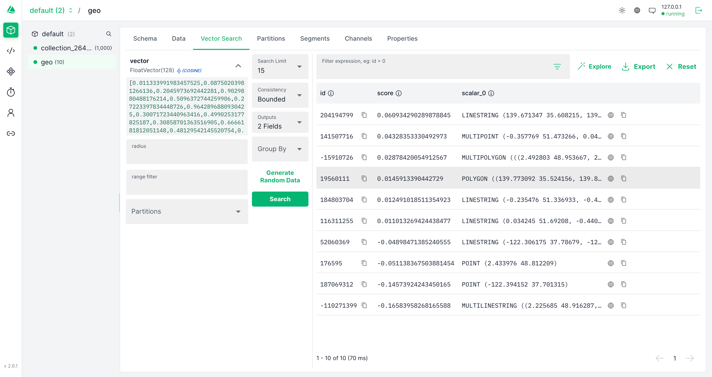

# Attu

Attu is an all-in-one milvus administration tool.


[](https://hub.docker.com/r/zilliz/attu/tags)


[](./README_CN.md)


Attu is designed to manage and interact with Milvus, offering features such as:

- **Database, Collection, and Partition Management:** Efficiently organize and manage your Milvus setup.
- **Insertion, Indexing, and Querying of Vector Embeddings:** Easily handle Milvus vector data operations.
- **Performing Vector Search:** Rapidly validate your results using the vector search feature.
- **User and Role Management:** Easily manage Milvus permissions and security.
- **Viewing System Topology:** Visualize Milvus system architecture for better management and optimization.
  
## Installation Guides

Before you begin, make sure that you have Milvus installed on either [Zilliz Cloud](https://cloud.zilliz.com/signup) or [your own server](https://milvus.io/docs/install_standalone-docker.md).

### Compatibility

| Milvus Version | Recommended Attu Version                                         |
| -------------- | ---------------------------------------------------------------- |
| 2.4.x          | [v2.4.4](https://github.com/zilliztech/attu/releases/tag/v2.4.4) |
| 2.3.x          | [v2.3.5](https://github.com/zilliztech/attu/releases/tag/v2.3.5) |
| 2.2.x          | [v2.2.8](https://github.com/zilliztech/attu/releases/tag/v2.2.8) |
| 2.1.x          | [v2.2.2](https://github.com/zilliztech/attu/releases/tag/v2.2.2) |

### Running Attu from Docker

Here are the steps to start a container for running Attu:

```code
docker run -p 8000:3000 -e MILVUS_URL={milvus server IP}:19530 zilliz/attu:v2.4
```

Make sure that the Attu container can access the Milvus IP address. After starting the container, open your web browser and enter `http://{ Attu IP }:8000` to view the Attu GUI.

#### Optional Environment Variables for Running Attu Docker

| Parameter        | Example              | Required | Description                             |
| :--------------- | :------------------- | :------: | --------------------------------------- |
| MILVUS_URL       | 192.168.0.1:19530    |  false   | Optional, Milvus server URL             |
| ATTU_LOG_LEVEL   | info                 |  false   | Optional, sets the log level for Attu   |
| ROOT_CERT_PATH   | /path/to/root/cert   |  false   | Optional, path to the root certificate  |
| PRIVATE_KEY_PATH | /path/to/private/key |  false   | Optional, path to the private key       |
| CERT_CHAIN_PATH  | /path/to/cert/chain  |  false   | Optional, path to the certificate chain |
| SERVER_NAME      | your_server_name     |  false   | Optional, name of your server           |
| SERVER_PORT      | Server listen port   |  false   | Optional, 3000 by default if unset      |

> Please note that the `MILVUS_URL` should be an address that the Attu Docker container can access. Therefore, "127.0.0.1" or "localhost" will not work.

To run the Docker container with these environment variables, use the following command:

#### Attu SSL Example

```bash
docker run -p 8000:3000 \
-v /your-tls-file-path:/app/tls \
-e ATTU_LOG_LEVEL=info  \
-e ROOT_CERT_PATH=/app/tls/ca.pem \
-e PRIVATE_KEY_PATH=/app/tls/client.key \
-e CERT_CHAIN_PATH=/app/tls/client.pem \
-e SERVER_NAME=your_server_name \
zilliz/attu:dev
```

#### Custom Server Port Example

_This command lets you run the docker container with host networking, specifying a custom port for
the server to listen on_

```bash
docker run --network host \
-v /your-tls-file-path:/app/tls \
-e ATTU_LOG_LEVEL=info  \
-e SERVER_NAME=your_server_name \
-e SERVER_PORT=8080 \
zilliz/attu:dev
```

### Running Attu within Kubernetes

Before you begin, make sure that you have Milvus installed and running within your [K8's Cluster](https://milvus.io/docs/install_cluster-milvusoperator.md). Note that Attu only supports Milvus 2.x.

Here are the steps to start a container for running Attu:

```code
kubectl apply -f https://raw.githubusercontent.com/zilliztech/attu/main/attu-k8s-deploy.yaml
```

Make sure that the Attu pod can access the Milvus service. In the example provided this connects directly to `my-release-milvus:19530`. Change this based on the Milvus service name. A more flexible way to achieve this would be to introduce a `ConfigMap`. See this [example]("https://raw.githubusercontent.com/zilliztech/attu/main/examples/attu-k8s-deploy-ConfigMap.yaml") for details.

### Running Attu behind a nginx proxy

[Running Attu behind a nginx proxy](https://github.com/zilliztech/attu/blob/main/doc/use-attu-behind-proxy.md)

### Install Desktop application

If you prefer to use a desktop application, you can download the [desktop version of Attu](https://github.com/zilliztech/attu/releases/).

### Build Docker Image Locally

- Dev: `yarn run build:dev`
- Release: `yarn run build:release`

## FAQ

- I can't log into the system
  > Make sure that the IP address of the Milvus server can be accessed from the Attu container. [#161](https://github.com/zilliztech/attu/issues/161)
- Mac M chip install app failed: attu.app is damaged and cannot be opened.
  ```shell
    sudo xattr -rd com.apple.quarantine /Applications/attu.app
  ```
- TBD

## More Screenshots

| create collection                                                                                    | collection tree                                                                              |
| ---------------------------------------------------------------------------------------------------- | -------------------------------------------------------------------------------------------- |
|  |  |

| collection overview                                                                                      | data view                                                                                   |
| -------------------------------------------------------------------------------------------------------- | ------------------------------------------------------------------------------------------- |
|  |  |

| vector search                                                                         | system view                                                                       |
| ------------------------------------------------------------------------------------- | --------------------------------------------------------------------------------- |
|  |  |

## ✨ Contributing Code

Thank you for your interest in contributing to Attu! Here's how you can build Attu locally to contribute code, test out the latest features, or try out an open PR:

### Build the Server

1. Fork and clone the Attu repository.
2. Navigate to the server directory by running `cd server` in the terminal.
3. Install dependencies by running `yarn install`.
4. To start the server in development mode, run `yarn start`.
5. Create a new branch for your PR by running `git checkout -b my-branch`.

### Build the Client

1. Fork and clone the Attu repository.
2. Navigate to the client directory by running `cd client` in the terminal.
3. Install dependencies by running `yarn install`.
4. To start the server in development mode, run `yarn start`.
5. Create a new branch for your PR by running `git checkout -b my-branch`.

### Submitting a Pull Request

1. Make changes and ensure that tests pass.
2. Commit changes and push to your fork.
3. Create a Pull Request targeting the main branch of Attu.

We appreciate your contributions to Attu, regardless of size. Thanks for supporting the project!

#### ❓ Do you have any questions or problems?

If you encounter any bugs or want to request a new feature, please create a [GitHub issue](https://github.com/zilliztech/attu/issues/new/choose). It's important to check if someone else has already created an issue for the same problem before submitting a new one.

### Useful Examples

[Milvus Typescript Examples](https://github.com/zilliztech/zilliz-cloud-typescript-example):This repo provides some simple React apps based on Next.js.

| Name                                                                                                                                   | Demo                                                   | Model                 |
| -------------------------------------------------------------------------------------------------------------------------------------- | ------------------------------------------------------ | --------------------- |
| [semantic-search-example](https://github.com/zilliztech/zilliz-cloud-typescript-example/tree/master/semantic-search-example)           | https://zilliz-semantic-search-example.vercel.app      | all-MiniLM-L6-v2      |
| [semantic-image-search](https://github.com/zilliztech/zilliz-cloud-typescript-example/tree/master/semantic-image-search)               |                                                        | clip-vit-base-patch16 |
| [semantic-image-search-client](https://github.com/zilliztech/zilliz-cloud-typescript-example/tree/master/semantic-image-search-client) | https://zilliz-semantic-image-search-client.vercel.app | clip-vit-base-patch16 |

### Userful links

Here are some helpful resources to get you started with Milvus:

- [Milvus documentation](https://milvus.io/docs): Here, you can find detailed information on how to use Milvus, including installation instructions, tutorials, and API documentation.
- [Milvus python SDK](https://github.com/milvus-io/pymilvus): The Python SDK allows you to interact with Milvus using Python. It provides a simple and intuitive interface for creating and querying vectors.
- [Milvus Java SDK](https://github.com/milvus-io/milvus-sdk-java): The Java SDK is similar to the Python SDK but designed for Java developers. It also provides a simple and intuitive interface for creating and querying vectors.
- [Milvus Go SDK](https://github.com/milvus-io/milvus-sdk-go): The Go SDK provides a Go API for Milvus. If you're a Go developer, this is the SDK for you.
- [Milvus Node SDK](https://github.com/milvus-io/milvus-sdk-node): The Node SDK provides a Node.js API for Milvus. If you're a Node.js developer, this is the SDK for you.
- [Feder](https://github.com/zilliztech/feder): Feder is a JavaScript tool designed to aid in the comprehension of embedding vectors.

## Community

💬 Join our vibrant community on the Milvus Discord where you can share your knowledge, ask questions and engage in meaningful conversations. It's not just about coding, it's about connecting with other like-minded individuals. Click the link below to join now!

<a href="https://discord.com/invite/8uyFbECzPX"></a>
