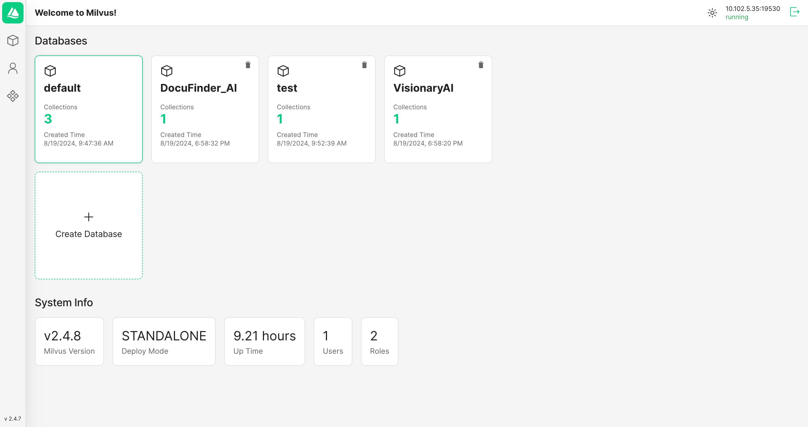
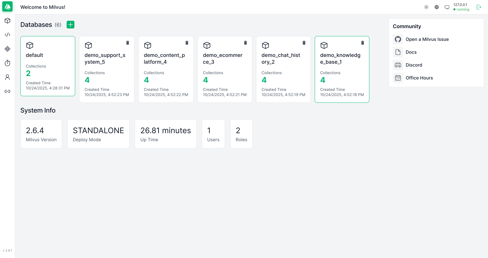
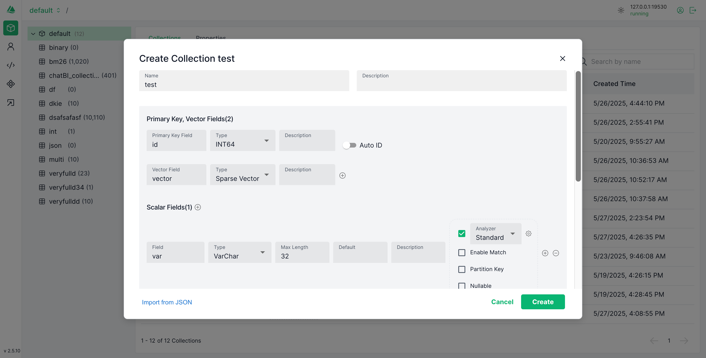
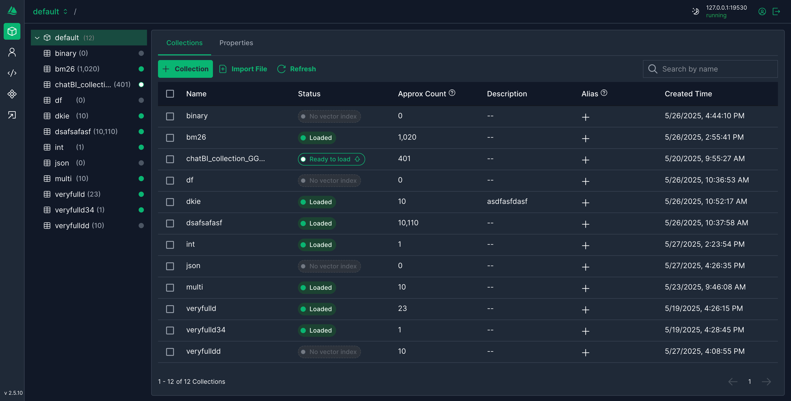
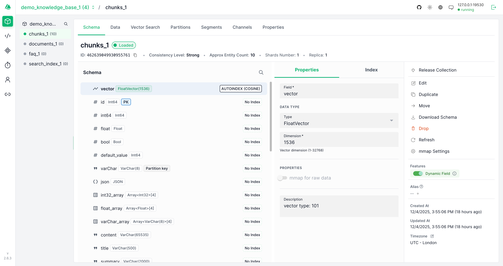
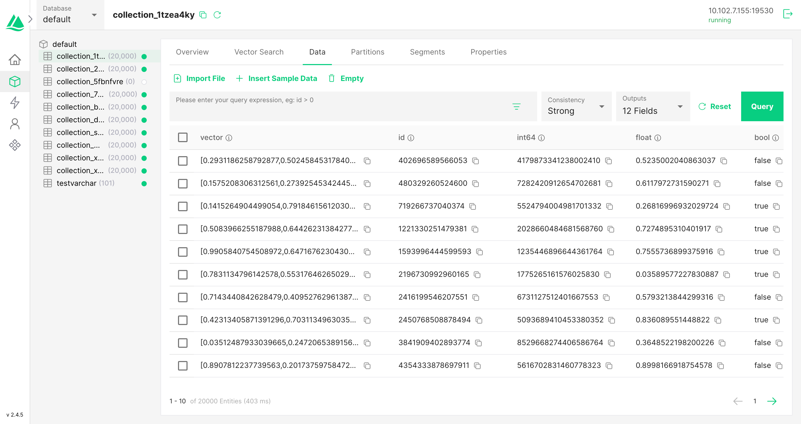
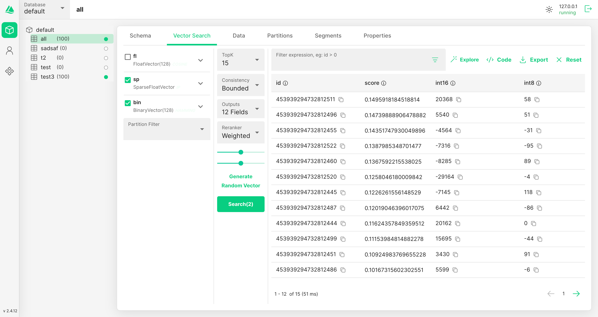
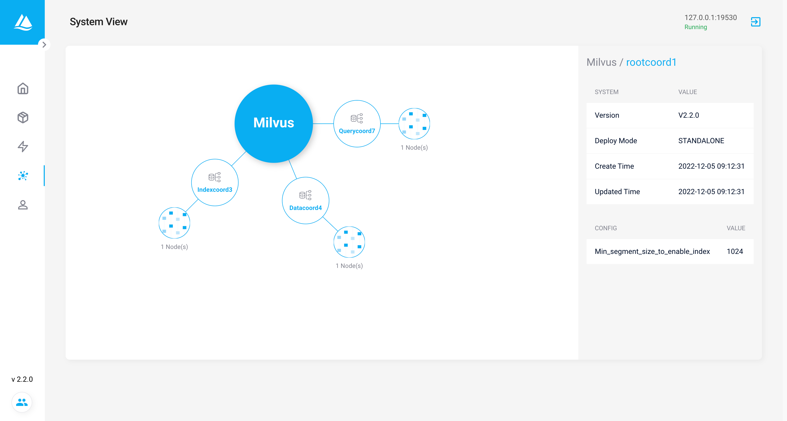

# Attu

Attu 是一个全方位的 Milvus 管理工具。


[](https://hub.docker.com/r/zilliz/attu/tags)


[](./README_CN.md)

<div style="display: flex; justify-content: space-between; gap: 8px;">
  
  
</div>
Attu 是一个通过用户友好的图形界面管理和操作 Milvus 的系统，提供以下功能：

- **数据库、集合和分区管理：** 只需点击几下鼠标即可高效地组织和管理您的数据库、集合和分区，帮助用户快速构建和导航 Milvus 设置。
- **向量的插入、索引和查询：** 通过简单的图形界面无缝插入、索引和查询向量，使用户能够高效地处理向量数据。
- **执行向量搜索：** 只需点击几下鼠标即可进行高性能的向量搜索，快速找到相似项，帮助用户迅速进行功能验证。
- **用户和角色管理：** 管理用户和角色，以确保安全和受控的访问权限，使用户能够快速管理权限和安全设置。
- **查看系统拓扑：** 可视化系统架构以实现更好的监督和管理，使用户能够迅速了解和优化他们的系统设置。
-

## 安装指南

在开始之前，请确保您已在 [Zilliz Cloud](https://cloud.zilliz.com/signup) 或 [您自己的服务器](https://milvus.io/docs/install_standalone-docker.md) 上安装了 Milvus。

### 兼容性

| Milvus 版本 | 推荐的 Attu 版本                                                   |
| ----------- | ------------------------------------------------------------------ |
| 2.5.x       | [v2.5.0](https://github.com/zilliztech/attu/releases/tag/v2.5.0)   |
| 2.4.x       | [v2.4.12](https://github.com/zilliztech/attu/releases/tag/v2.4.12) |
| 2.3.x       | [v2.3.5](https://github.com/zilliztech/attu/releases/tag/v2.3.5)   |
| 2.2.x       | [v2.2.8](https://github.com/zilliztech/attu/releases/tag/v2.2.8)   |
| 2.1.x       | [v2.2.2](https://github.com/zilliztech/attu/releases/tag/v2.2.2)   |

### 从 Docker 运行 Attu

以下是运行 Attu 容器的步骤：

```bash
docker run -p 8000:3000 -e MILVUS_URL={milvus server IP}:19530 zilliz/attu:v2.4
```

确保 Attu 容器可以访问 Milvus IP 地址。启动容器后，在您的浏览器中输入 `http://{ Attu IP }:8000` 以查看 Attu GUI。

#### 运行 Attu Docker 的可选环境变量

| 参数             | 示例                 | 必填 | 描述                       |
| :--------------- | :------------------- | :--: | -------------------------- |
| MILVUS_URL       | 192.168.0.1:19530    |  否  | 可选，Milvus 服务器 URL    |
| ATTU_LOG_LEVEL   | info                 |  否  | 可选，设置 Attu 的日志级别 |
| ROOT_CERT_PATH   | /path/to/root/cert   |  否  | 可选，根证书的路径         |
| PRIVATE_KEY_PATH | /path/to/private/key |  否  | 可选，私钥的路径           |
| CERT_CHAIN_PATH  | /path/to/cert/chain  |  否  | 可选，证书链的路径         |
| SERVER_NAME      | your_server_name     |  否  | 可选，您的服务器名称       |
| SERVER_PORT      | Server listen port   |  否  | 可选，默认 3000            |

> 请注意，`MILVUS_URL` 应为 Attu Docker 容器可访问的地址，因此 "127.0.0.1" 或 "localhost" 将无法使用。

使用以下命令运行带有这些环境变量的 Docker 容器：

#### Attu SSL 示例

```bash
docker run -p 8000:3000 \
-v /your-tls-file-path:/app/tls \
-e ATTU_LOG_LEVEL=info  \
-e ROOT_CERT_PATH=/app/tls/ca.pem \
-e PRIVATE_KEY_PATH=/app/tls/client.key \
-e CERT_CHAIN_PATH=/app/tls/client.pem \
-e SERVER_NAME=your_server_name \
zilliz/attu:dev
```

#### 自定义服务器端口示例

_此命令允许您使用主机网络运行 Docker 容器，指定服务器监听的自定义端口_

```bash
docker run --network host \
-v /your-tls-file-path:/app/tls \
-e ATTU_LOG_LEVEL=info  \
-e SERVER_NAME=your_server_name \
-e SERVER_PORT=8080 \
zilliz/attu:dev
```

### 在 Kubernetes 中运行 Attu

在开始之前，请确保您已在 [K8's 集群](https://milvus.io/docs/install_cluster-milvusoperator.md) 中安装并运行了 Milvus。请注意，Attu 仅支持 Milvus 2.x。

以下是运行 Attu 容器的步骤：

```bash
kubectl apply -f https://raw.githubusercontent.com/zilliztech/attu/main/attu-k8s-deploy.yaml
```

确保 Attu pod 可以访问 Milvus 服务。在提供的示例中，这将直接连接到 `my-release-milvus:19530`。根据 Milvus 服务名称更改此设置。实现这一目标的更灵活方法是引入 `ConfigMap`。详见此 [示例]("https://raw.githubusercontent.com/zilliztech/attu/main/examples/attu-k8s-deploy-ConfigMap.yaml")。

### 在 nginx 代理后运行 Attu

[在 nginx 代理后运行 Attu](https://github.com/zilliztech/attu/blob/main/doc/use-attu-behind-proxy.md)

### 安装桌面应用程序

如果您更喜欢使用桌面应用程序，可以下载 [Attu 的桌面版本](https://github.com/zilliztech/attu/releases/)。

### 本地构建 Docker 镜像

- 开发版：`yarn run build:dev`
- 发布版：`yarn run build:release`

## 常见问题

- 无法登录系统
  > 确保 Milvus 服务器的 IP 地址可以从 Attu 容器访问。[#161](https://github.com/zilliztech/attu/issues/161)
- Mac M 芯片安装应用失败：attu.app 已损坏，无法打开。
  ```shell
    sudo xattr -rd com.apple.quarantine /Applications/attu.app
  ```
- 待补充

## 更多截图

| create collection                                                                                    | collection tree                                                                              |
| ---------------------------------------------------------------------------------------------------- | -------------------------------------------------------------------------------------------- |
|  |  |

| collection overview                                                                                      | data view                                                                                   |
| -------------------------------------------------------------------------------------------------------- | ------------------------------------------------------------------------------------------- |
|  |  |

| vector search                                                                         | system view                                                                       |
| ------------------------------------------------------------------------------------- | --------------------------------------------------------------------------------- |
|  |  |

## ✨ 代码贡献

感谢您对 Attu 的贡献兴趣！以下是本地构建 Attu 以贡献代码、测试最新功能或试用开放 PR 的方法：

### 构建服务器

1. Fork 并克隆 Attu 仓库。
2. 通过在终端中运行 `cd server` 进入服务器目录。
3. 运行 `yarn install` 安装依赖。
4. 运行 `yarn start` 启动开发模式的服务器。
5. 运行 `git checkout -b my-branch` 创建新分支以提交 PR。

### 构建客户端

1. Fork 并克隆 Attu 仓库。
2. 通过在终端中运行 `cd client` 进入客户端目录。
3. 运行 `yarn install` 安装依赖。
4. 运行 `yarn start` 启动开发模式的服务器。
5. 运行 `git checkout -b my-branch` 创建新分支以提交 PR。

### 提交 Pull Request

1. 做出更改并确保测试通过。
2. 提交更改并推送到您的 Fork。
3. 创建一个 Pull Request 目标 Attu 的 main 分支。

无论大小，我们都感谢您对 Attu 的贡献。感谢您对项目的支持！

#### ❓ 有任何问题或困难？

如果您遇到任何错误或希望请求新功能，请创建一个 [GitHub issue](https://github.com/zilliztech/attu/issues/new/choose)。在提交新问题之前，检查是否已有其他人创建了相同问题。

### 有用的示例

[Milvus Typescript 示例](https://github.com/zilliztech/zilliz-cloud-typescript-example)：此仓库提供了一些基于 Next.js 的简单 React 应用程序。

| 名称                                                                                                                         | 演示                                              | 模型                  |
| ---------------------------------------------------------------------------------------------------------------------------- | ------------------------------------------------- | --------------------- |
| [semantic-search-example](https://github.com/zilliztech/zilliz-cloud-typescript-example/tree/master/semantic-search-example) | https://zilliz-semantic-search-example.vercel.app | all-MiniLM-L6-v2      |
| [semantic-image-search](https://github.com/zilliztech/zilliz-cloud-typescript-example/tree/master/semantic-image-search)     |                                                   | clip-vit-base-patch16 |

| [semantic-image-search

-client](https://github.com/zilliztech/zilliz-cloud-typescript-example/tree/master/semantic-image-search-client) | https://zilliz-semantic-image-search-client.vercel.app | clip-vit-base-patch16 |

### 有用的链接

以下是一些有助于您入门 Milvus 的资源：

- [Milvus 文档](https://milvus.io/docs)：在这里，您可以找到有关如何使用 Milvus 的详细信息，包括安装说明、教程和 API 文档。
- [Milvus Python SDK](https://github.com/milvus-io/pymilvus)：Python SDK 允许您使用 Python 进行 Milvus 交互。它提供了一个简单直观的界面来创建和查询向量。
- [Milvus Java SDK](https://github.com/milvus-io/milvus-sdk-java)：Java SDK 类似于 Python SDK，但专为 Java 开发人员设计。它也提供了一个简单直观的界面来创建和查询向量。
- [Milvus Go SDK](https://github.com/milvus-io/milvus-sdk-go)：Go SDK 提供了 Milvus 的 Go API。如果您是 Go 开发人员，这是适合您的 SDK。
- [Milvus Node SDK](https://github.com/milvus-io/milvus-sdk-node)：Node SDK 提供了 Milvus 的 Node.js API。如果您是 Node.js 开发人员，这是适合您的 SDK。
- [Feder](https://github.com/zilliztech/feder)：Feder 是一个 JavaScript 工具，旨在帮助理解嵌入向量。

## 社区

💬 加入我们充满活力的 Milvus 社区，在那里您可以分享知识、提问并参与有意义的对话。这不仅仅是编码，更是与志同道合的人们交流。点击下面的链接立即加入！

<a href="https://discord.com/invite/8uyFbECzPX"></a>
