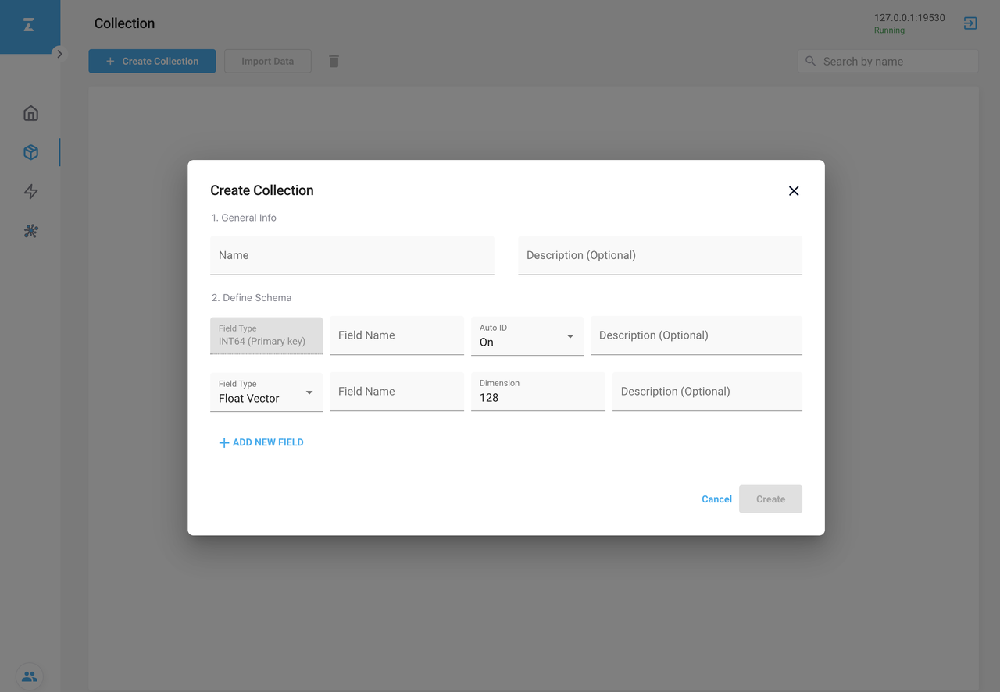
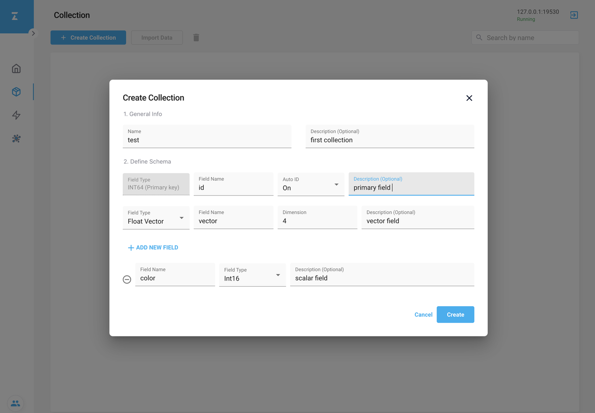
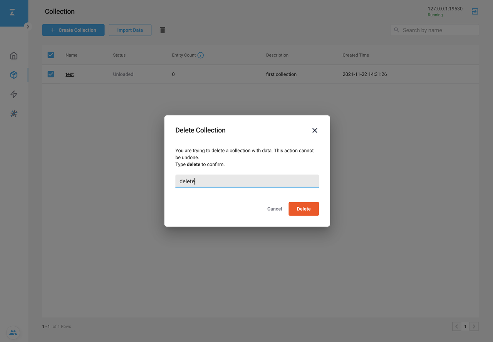
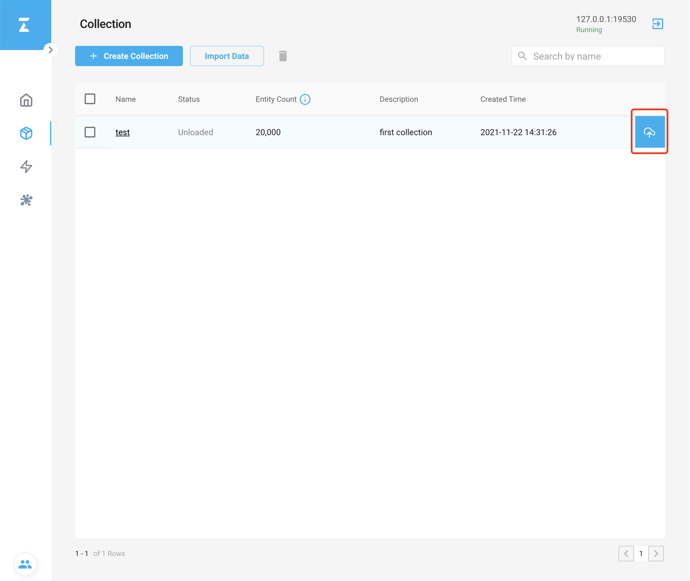
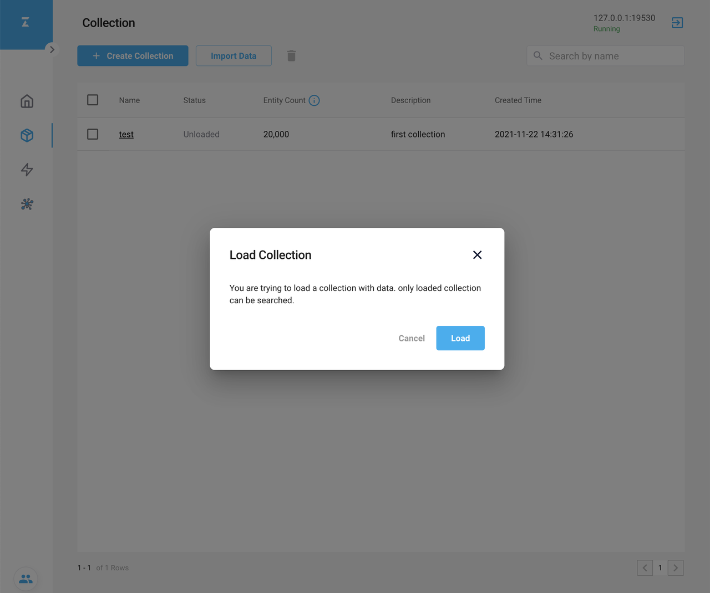
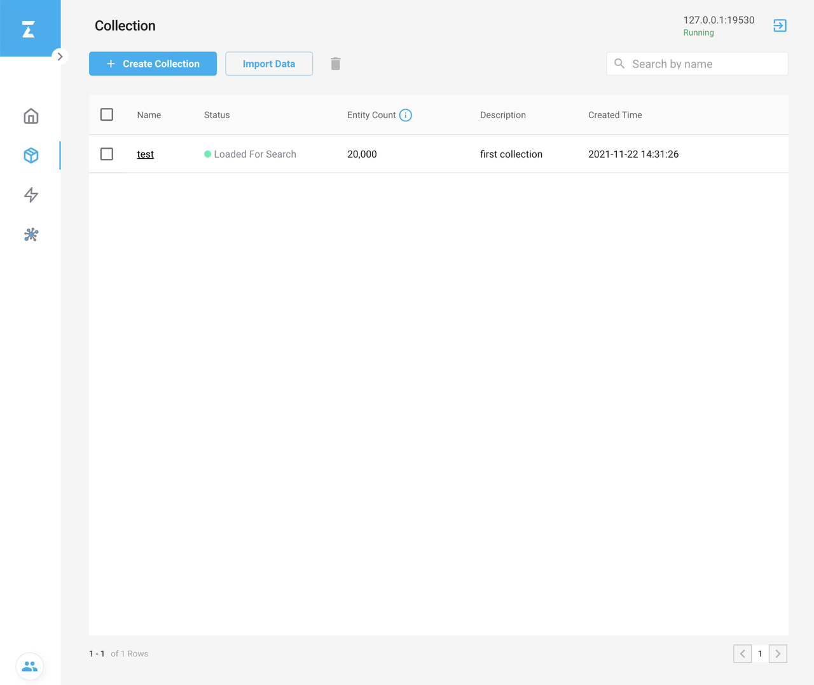
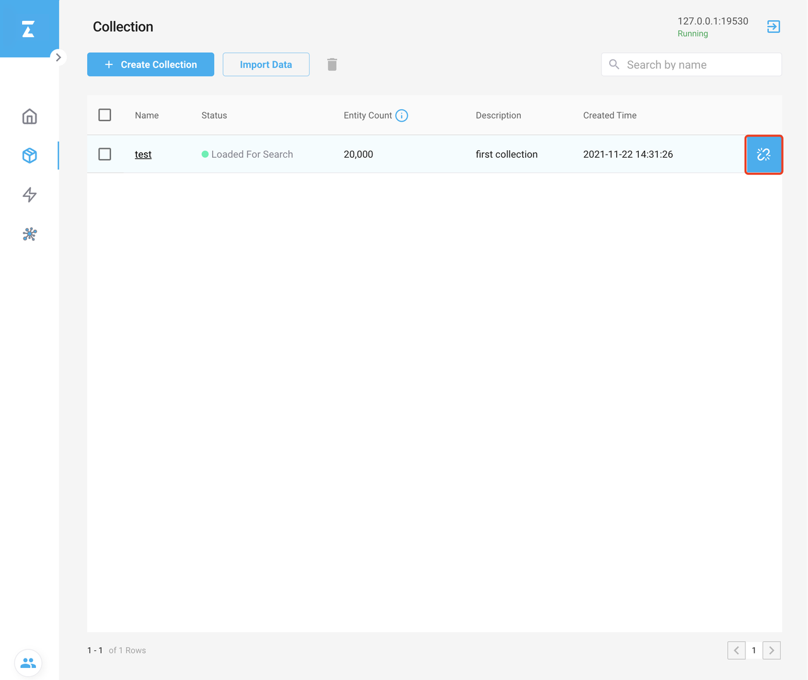
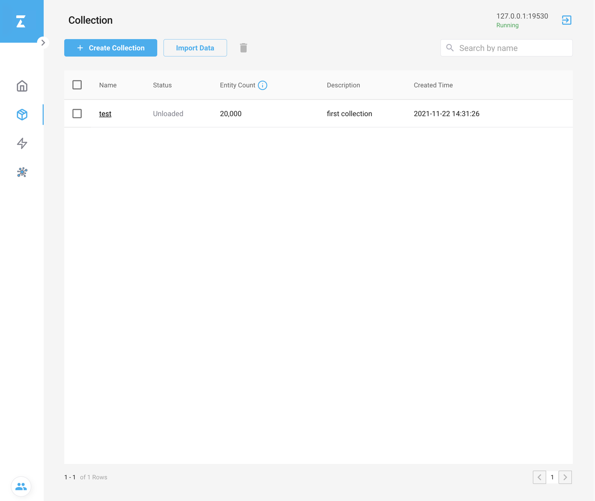
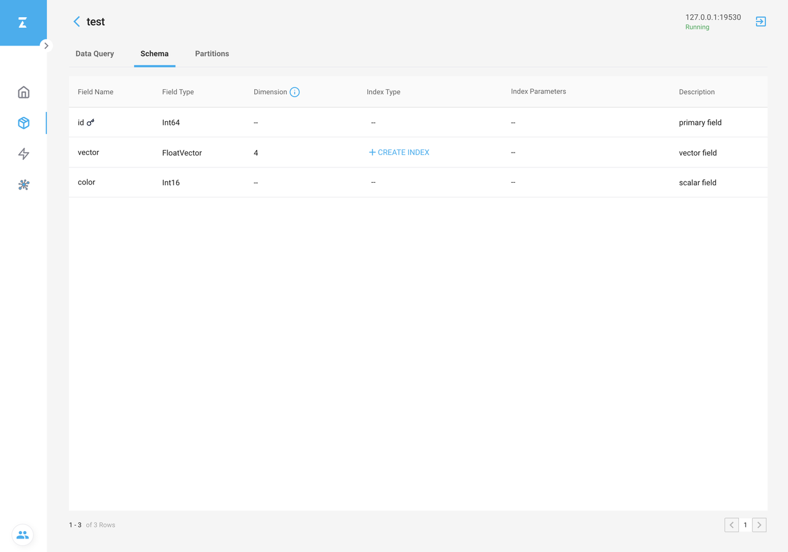

# Manage Collections with Attu

This topic describes how to manage collections with Attu.

## Create a collection

1. Click the **Collection** icon on the left-side navigation pane and then click **Create Collection**. The **Create Collection** dialog box appears as shown below.

2. Enter the required information. This example creates a collection named `test` with a primary key field, a vector field, and a scalar field. You can add scalar fields as needed.

3. Click **Create** to create a collection.

## Delete a collection

1. Tick the collection you want to delete in the data grid.
2. Click the **Trash** icon and the **Delete Collection** dialog box appears as shown below.
3. Type `delete` to confirm the deletion.
4. Click **Delete** to delete the collection.

Deleting a collection is irreversible.

## Load a collection

1. Hover on the collection you want to load, the **Load** icon appears on the right end of the entry.

2. Click the **Load** icon and the **Load Collection** dialog box appears.
3. Click **Load** in the **Load Collection** dialog box.

4. Loading a collection might take a while. If successful, Loaded For Search appears in the Status column.

## Release a collection

1. Hover on the loaded collection you want to release, the **Release** icon appears on the right end of the entry.

2. Click the **Release** icon and the **Release Collection** dialog box appears.
3. Click **Release** in the **Release Collection** dialog box.
4. If successful, the Status becomes **Unloaded** in the **Status** column.

## View the schema of a collection

1. Click the name of the collection that you want to view the schema of, and the corresponding detail page appears.
2. Click **Schema** on the detail page, which lists the information of all fields.

Attributes of a schema include:

- Field Name
- Field Type
- Dimension (Only applies to vector fields)
- Index Type (Only applies to vector fields)
- Index Parameters (Only applies to vector fields)
- Collection description

