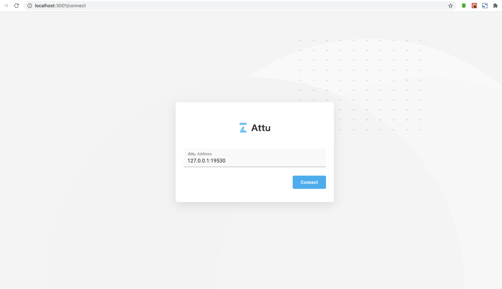

# Install Attu

This topic describes how to install Attu, an efficient open-source management tool for Milvus.

{{tab}}

## Prerequisites

- Kubernetes 1.16 or later
- Helm 3.0.0 or later

<div class="alert note">
Attu only supports Milvus 2.x.
</div>

## Install Helm Chart for Milvus

Helm is a Kubernetes package manager that can help you deploy Milvus quickly.

1. Add Milvus Helm repository.

```
$ helm repo add milvus https://milvus-io.github.io/milvus-helm/
```

2. Update charts locally.

```
$ helm repo update
```

## Install Attu while installing Milvus

Start Milvus and Attu with Helm by specifying the release name, the chart, and the parameters that indicate the installation and service mode of Attu. This topic uses `my-release` as the release name. To use a different release name, replace `my-release` in the command.

Attu provides services in the following three modes among which you can select to suit your scenario. It is recommended to use Ingress mode. Port-forward mode is suggested to be used in test environment only.

- [Ingress mode](#Ingress-mode)
- [LoadBalancer mode](#LoadBalancer-mode)
- [Port-forward mode](#Port-forward-mode)

### Ingress mode

Ensure that you have integrated Ingress controller in your Kubernetes cluster.

1. Install Milvus and Attu.

```
helm install my-release milvus/milvus --set attu.enabled=true
```

2. Check the established Ingress.

```
kubectl get ingress
```

3. Check the addresses that correspond to `my-release-milvus-attu` in the returned result.

```
NAME                          CLASS    HOSTS                  ADDRESS                               PORTS   AGE
my-release-milvus-attu        <none>   milvus-attu.local      10.100.32.1,10.100.32.2,10.100.32.3   80      22h
```

4. Configure DNS on the device that requires the Attu service by mapping the path `milvus-attu.local` onto any of the addresses returned above in the system file `/etc/hosts`.

```
10.100.32.1     milvus-attu.local
```

5. Visit `http://milvus-attu.local` in your browser, and click **Connect** to enter the Attu service.



### LoadBalancer mode

Ensure that you have integrated LoadBalancer in your Kubernetes cluster.

1. Install Milvus and Attu.

```
helm install my-release milvus/milvus --set attu.enabled=true --set attu.service.type=LoadBalancer --set attu.ingress.enabled=false
```

2. Check the Attu service.

```
kubectl get svc
```

3. Check the external IP of the service `my-release-milvus-attu` in the returned results.

```
NAME                                    TYPE           CLUSTER-IP      EXTERNAL-IP   PORT(S)
my-release-etcd                        ClusterIP      10.96.106.84    <none>        2379/TCP,2380/TCP                     117s
my-release-etcd-headless               ClusterIP      None            <none>        2379/TCP,2380/TCP                     117s
my-release-milvus                      ClusterIP      10.96.230.238   <none>        19530/TCP,9091/TCP                    117s
my-release-milvus-datacoord            ClusterIP      10.96.75.27     <none>        13333/TCP,9091/TCP                    117s
my-release-milvus-datanode             ClusterIP      None            <none>        9091/TCP                              117s
my-release-milvus-indexcoord           ClusterIP      10.96.183.151   <none>        31000/TCP,9091/TCP                    117s
my-release-milvus-indexnode            ClusterIP      None            <none>        9091/TCP                              117s
my-release-milvus-attu                 LoadBalancer   10.96.79.103    10.98.0.16    3000:30413/TCP                        117s
my-release-milvus-querycoord           ClusterIP      10.96.204.140   <none>        19531/TCP,9091/TCP                    117s
my-release-milvus-querynode            ClusterIP      None            <none>        9091/TCP                              117s
my-release-milvus-rootcoord            ClusterIP      10.96.142.19    <none>        53100/TCP,9091/TCP                    117s
my-release-minio                       ClusterIP      10.96.55.66     <none>        9000/TCP                              117s
my-release-minio-svc                   ClusterIP      None            <none>        9000/TCP                              117s
my-release-pulsar-bookkeeper           ClusterIP      None            <none>        3181/TCP                              117s
my-release-pulsar-broker               ClusterIP      10.96.177.151   <none>        8080/TCP,6650/TCP,8443/TCP,6651/TCP   117s
my-release-pulsar-proxy                ClusterIP      10.96.148.241   <none>        8080/TCP,6650/TCP,8000/TCP            117s
my-release-pulsar-zookeeper            ClusterIP      None            <none>        2888/TCP,3888/TCP,2181/TCP            117s
my-release-pulsar-zookeeper-ca         ClusterIP      10.96.100.254   <none>        2888/TCP,3888/TCP,2181/TCP            117s
```

4. Configure DNS on the device that requires the Attu service by mapping the path `my-release-milvus-attu` onto its external IP returned above in the system file `/etc/hosts`.

```
10.98.0.16 my-release-milvus-attu
```

5. Visit `http://my-release-milvus-attu:3000/connect` in your browser, and click **Connect** to enter the Attu service.


### Port-forward mode

1. Install Milvus and Attu.

```
helm install my-release milvus/milvus --set attu.enabled=true  --set attu.ingress.enabled=false
```

2. Forward the Attu service to local port `3000`.

```
kubectl port-forward service/my-release-milvus-attu 3000
```

3. Configure DNS on the device that forwards the Attu service by mapping the path `my-release-milvus-attu` onto `127.0.0.1` in the system file `/etc/hosts`.

```
127.0.0.1 my-release-milvus-attu
```

4. Visit `http://my-release-milvus-attu:3000/connect` in your browser, and click **Connect** to enter the Attu service.


## Contribution

Attu is an open-source project. All contributions are welcome. Please read our [Contribute guide](https://github.com/zilliztech/attu) before making contributions.

If you find a bug or want to request a new feature, please create a [GitHub Issue](https://github.com/zilliztech/attu), and make sure that the same issue has not been created by someone else.
