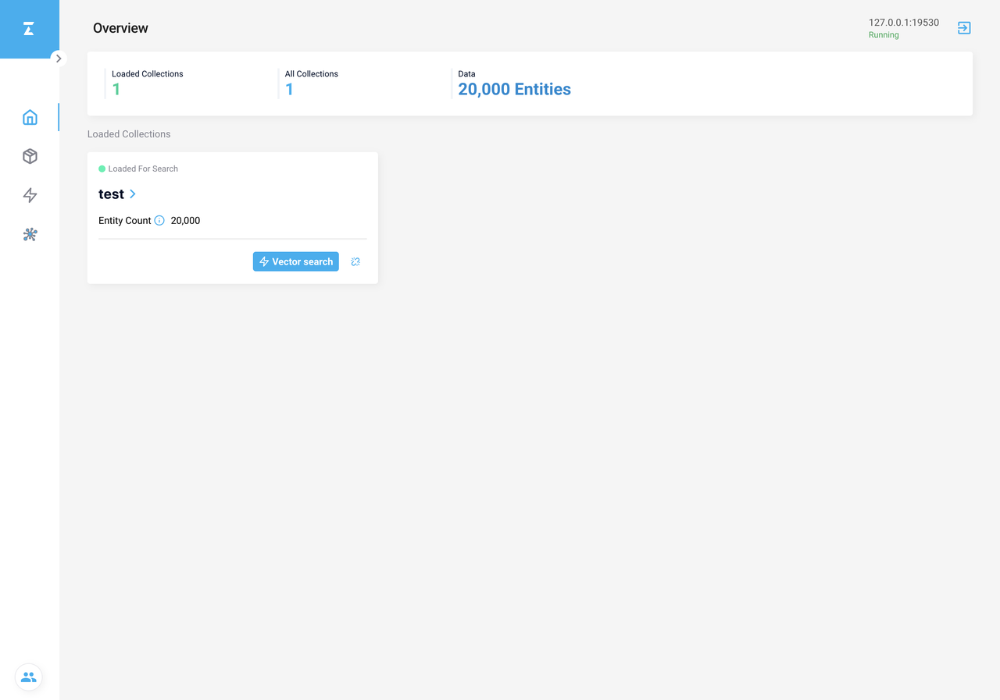

# Attu Overview Page

This topic describes the Home page of Attu.

Attu consists of **Overview** page, **Collection** page, **Vector Search** page, and **System View** page, corresponding to the four icons on the left-side navigation pane respectively.

The Overview page lists the following information:

1. Loaded Collections: the number of loaded collections.
2. All Collections: the total number of collections.
3. Data: the total number of entities.
4. **Loaded For Search** card: an interactive shortcut panel that allows you to perform a [vector search](attu_search.md) on or [release the collection](attu_collection.md).

