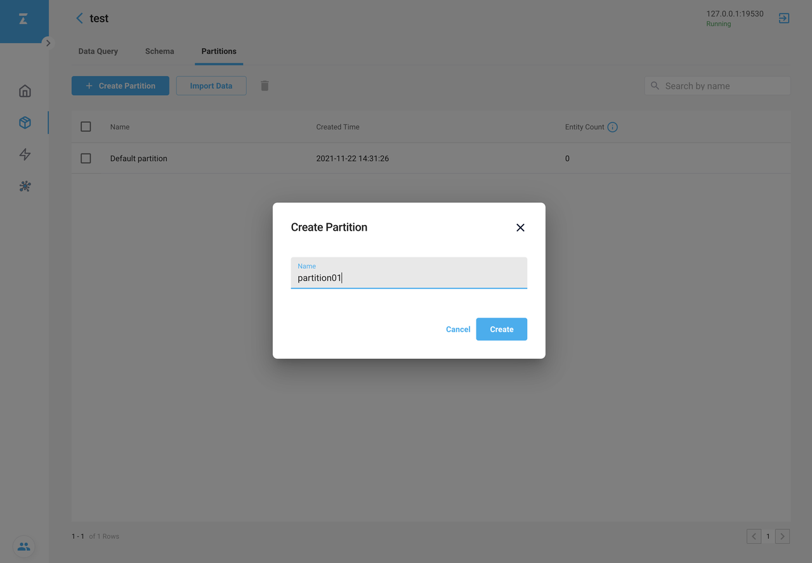
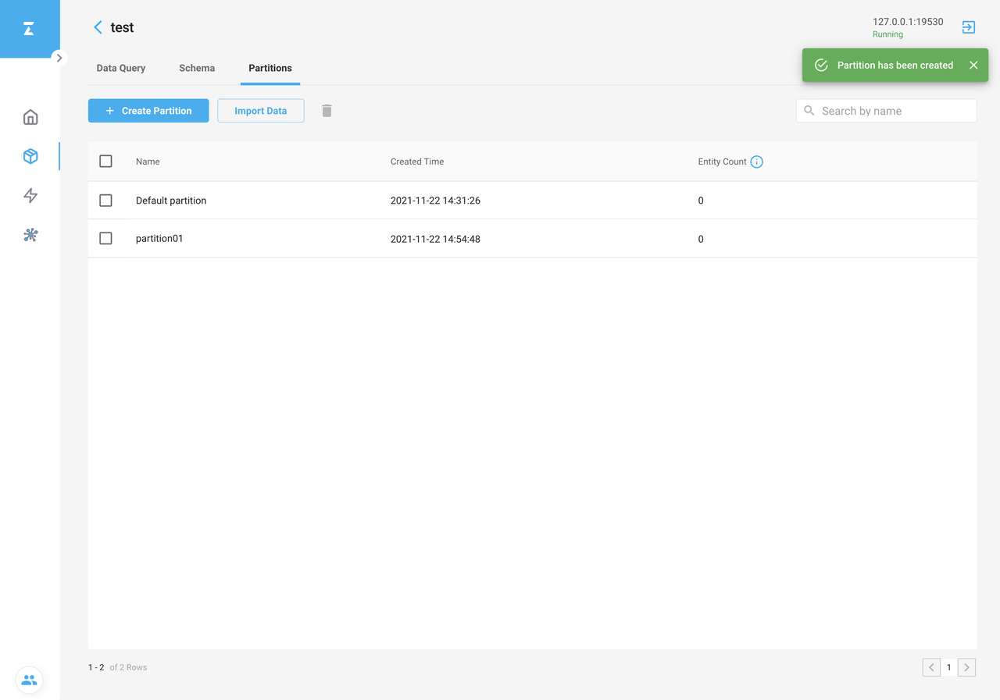
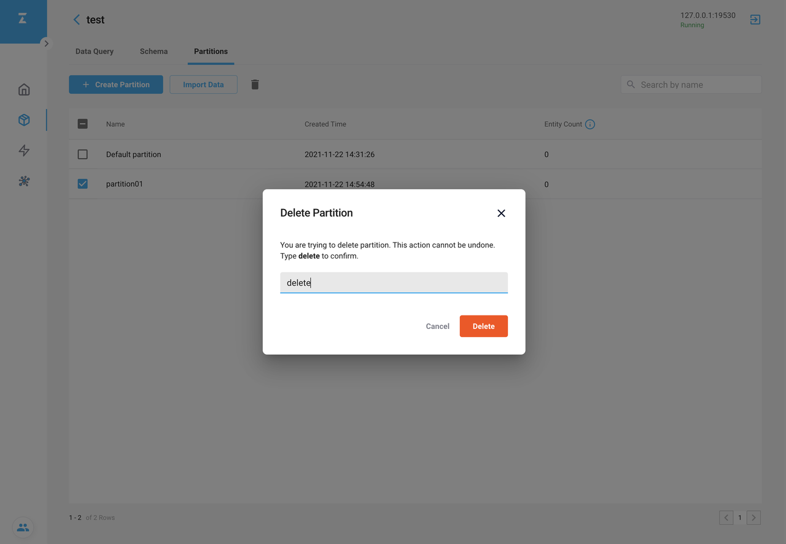

# Manage Partitions with Attu

This topic describes how to manage partitions with Attu.

Milvus creates a partition automatically after a collection is created, which cannot be deleted.

## Create a partition

1. Click **Partitions** tab on the **Collection** page.
2. Click **Create Partition** on the **Partitions** tab page, and the **Create Partition** dialog box appears as shown below.
3. In the **Create Partition** dialog box, enter the new partition name in the **Name** field.
4. Click **Create** to create a partition.

If successful, the new partition appears on the **Partitions** tab page.

Choose the Default partition or the newly created partition to store imported data as needed.

## Delete a partition

1. Tick the partition you want to delete.
2. Click the **Trash** icon and the **Delete Partition** dialog box appears as shown below.
3. Type `delete` to confirm the deletion.
4. Click **Delete** to delete the partition.

