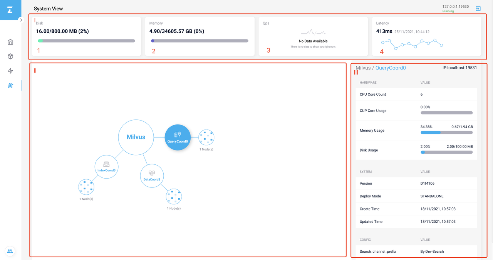
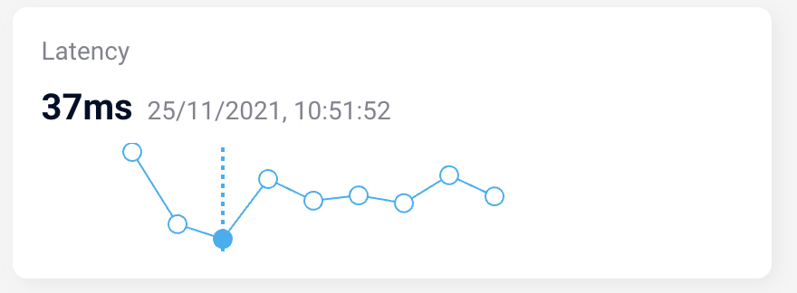
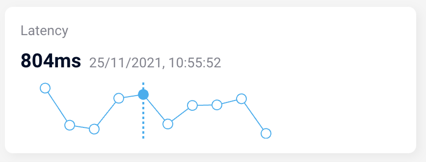
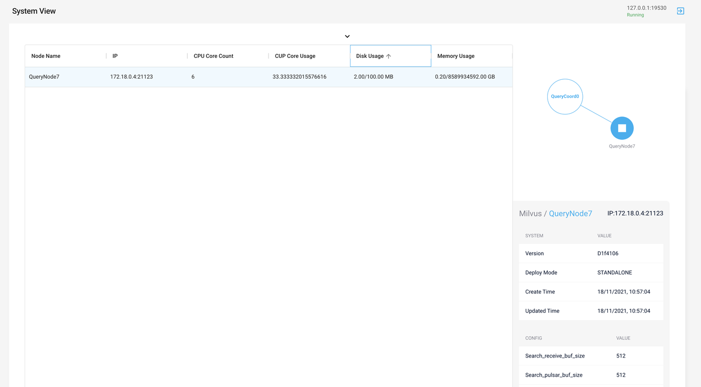

# Monitor System with Attu

This topic describes how to monitor your Milvus system with Attu.

## System view

Click the **System View** icon on the left-side navigation pane to visit the System View page.

The System View dashboard consists of the following tiles:

- **Disk**: Shows the usage of storage space.
- **Memory**: Shows the usage of memory.
- **Qps**: Shows the last 10 monitored QPS. Each node represents a time point. Hover on a node to view the QPS monitored at the time point.
- **Latency**: Shows the last 10 monitored latency. Each node represents a time point. Hover on a node to view the latency monitored at the time point.

- **Topology**: Shows the structure of your Milvus instance. Click Milvus node or a coordinator node and the corresponding information appears in the Info tile on the right.
- **Info**: Shows the hardware, system, and configuration information of the selected node.

## Node list view

All nodes managed by their parent coordinator node are listed in the table. You can sort the nodes by metrics including **CPU Core Count**, **CPU Core Usage**, **Disk Usage**, and **Memory Usage**.

Right to the table is a mini topology showing the selected node and its coordinator node. Under the mini topology is a tile showing relevant information.

Click the down arrow to collapse rows in the table.
