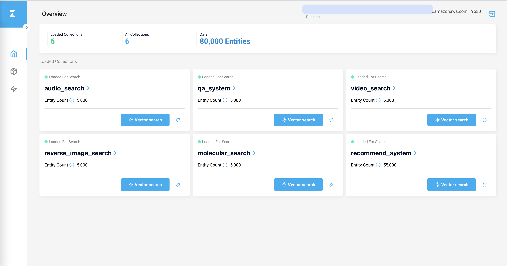
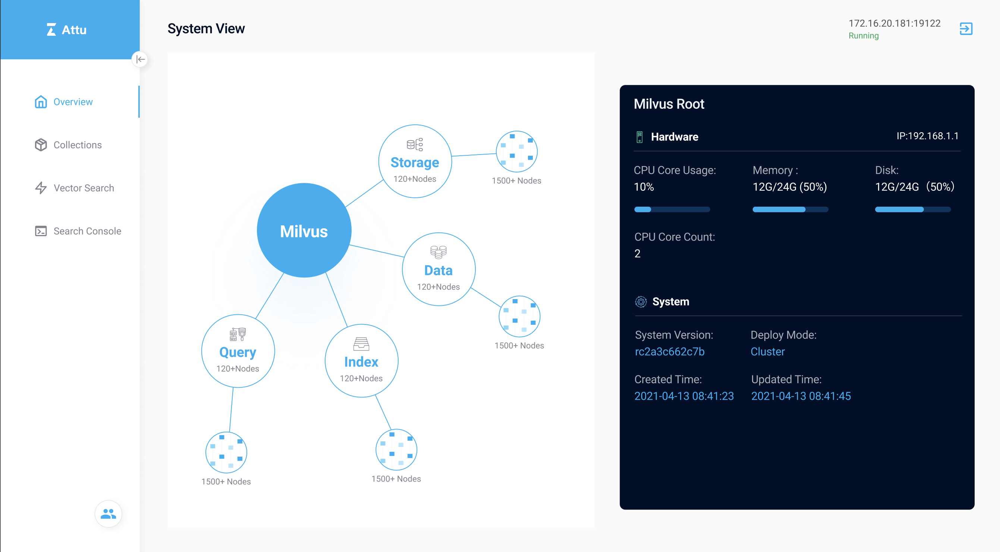
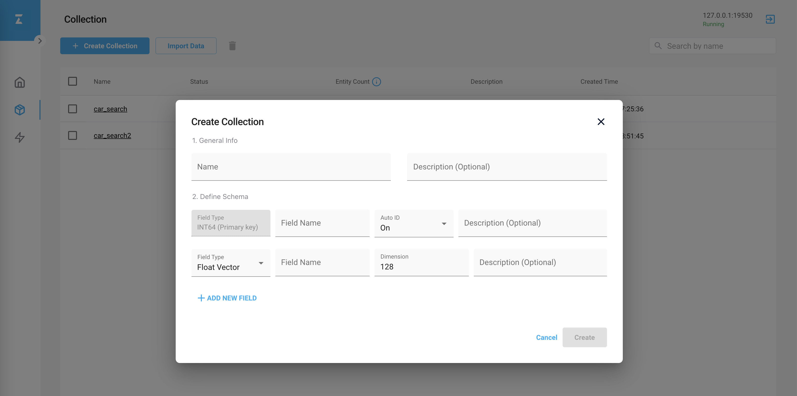
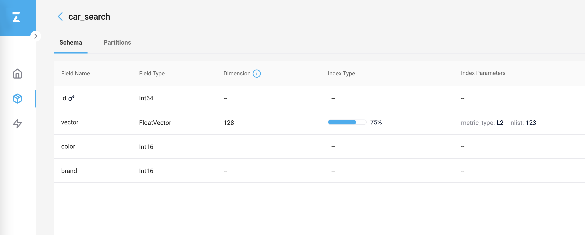
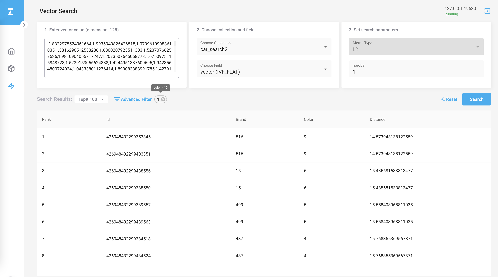
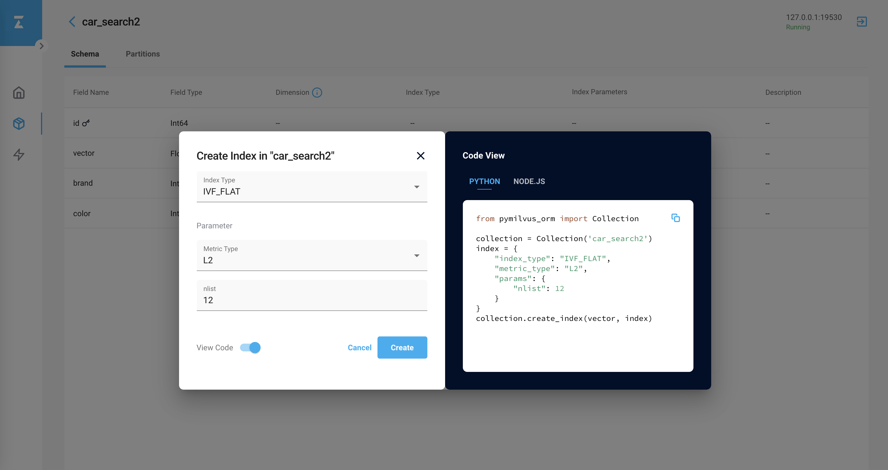

# Attu

[Attu](https://github.com/zilliztech/attu) 是 Milvus 的高效开源管理工具. 它具有直观的图形用户界面 (GUI)，可让您轻松与数据库进行交互。 只需点击几下，您就可以可视化集群状态、管理元数据、执行数据查询等等。

## 特点

Attu 正在快速开发中，每周都会添加新功能。每当新功能准备就绪时，我们都会发布新版本。

以下是我们必须提供的功能：

- Milvus 集群统计信息一目了然。

- 以简单直接的方式浏览、查询和管理集合。

- 只需单击几下即可执行 CRUD 或批量操作。

- 创建矢量索引。

- 以全新的方式进行向量相似度搜索。

- 新的代码模式为您提供更好的用户体验。

阅读[安装 Attu](attu_install-docker.md) 以了解更多。

## 贡献

Attu 是一个开源项目。欢迎所有贡献者。在提交代码前，请阅读我们的[贡献指南](https://github.com/zilliztech/attu)。

如果您发现错误或想要请求新功能， 请创建一个 [GitHub Issue](https://github.com/zilliztech/attu)，并确保其他人没有创建相同的问题。
