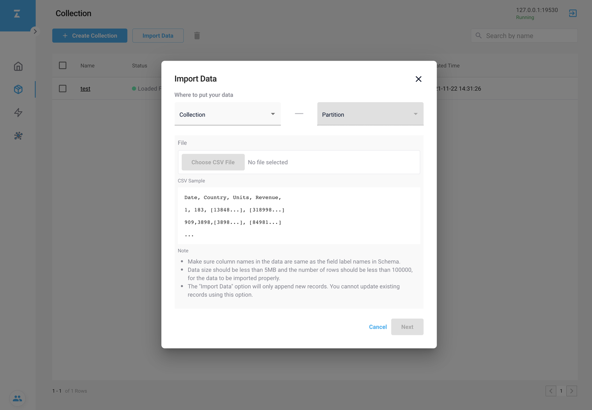
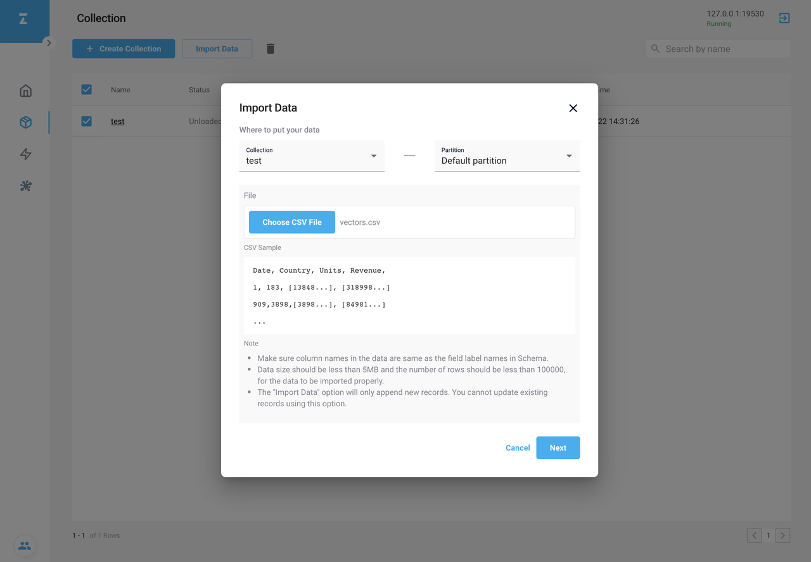
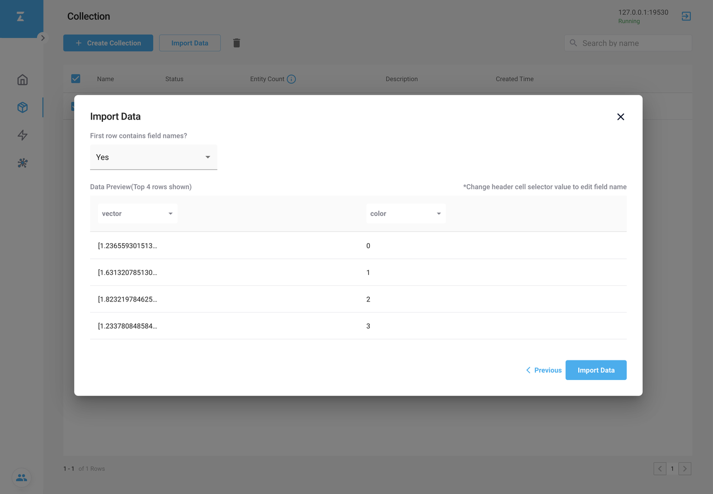
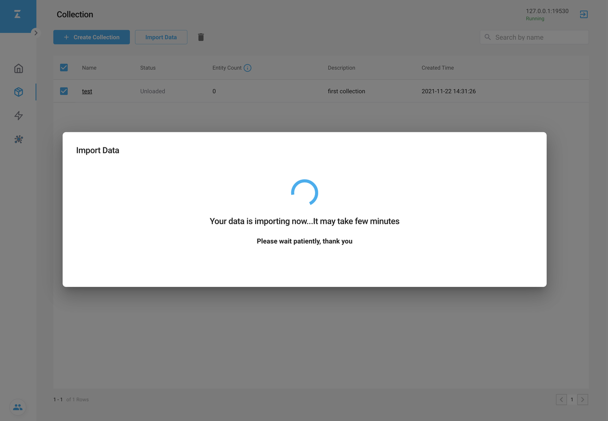
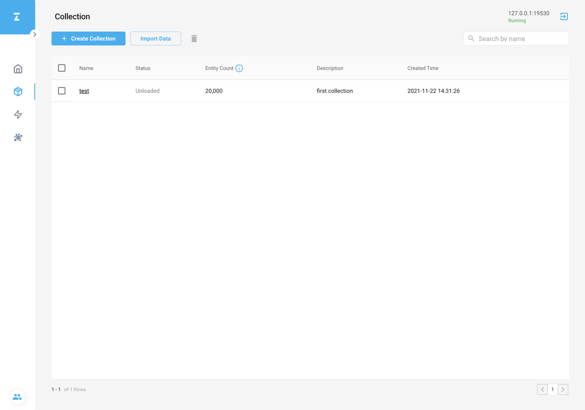
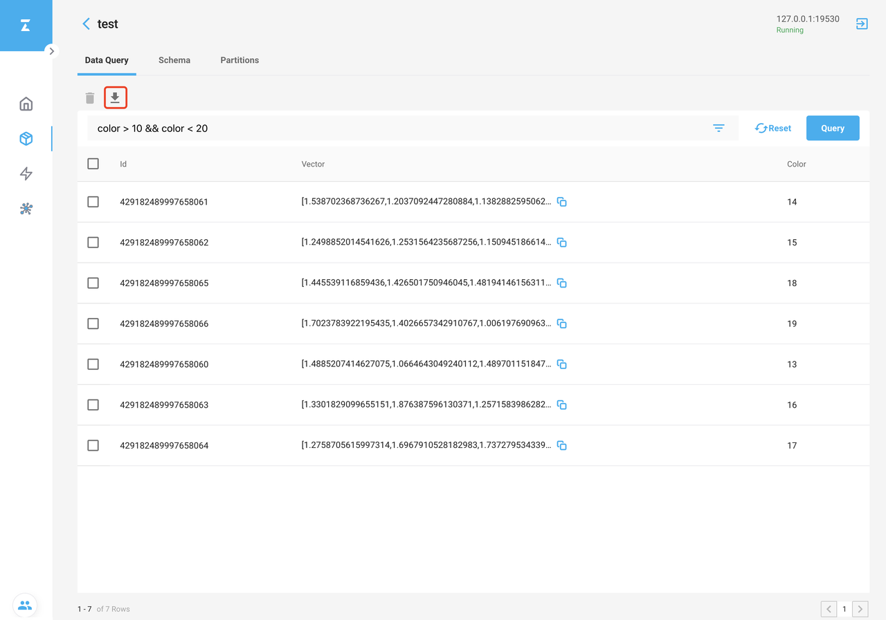

# 使用 Attu 管理数据

这片文章将会描述如何使用 Attu 管理数据。

## 导入数据

这个例子将导入 20,000 行数据。导入数据是追加数据，而不是覆盖数据。

1. 在 **Collection** 页面，点击 **Import Data** 按钮。如下图所示，将会出现 **Import Data** 对话框。

2. 在 **Collection** 下拉列表框中，选择需要的 collection 来导入数据。
3. 在 **Partition** 下拉列表框中，选择需要的 partition 来导入数据。
4. 点击 **Choose CSV File** 选择 CSV 文件。

 需要保证 CSV 文件符合以下条件：
<ul>
<li>
列名与 collection 中 schema 的字段名完全一致。
</li>
<li>
上传的 CSV 文件需要小于 150MB，以及行的总数小于 100,000。
</li>
</ul>

5. 上传了一个合法的 CSV 文件以后，便可以点击 **Next**。

6. 在新的对话框中，你可以选择在下拉列表框中选择列名。

我们推荐在 CSV 文件的首行设置你的列名。

7. 在确认完列名与 collection 的字段一致后，点击 **Import Data** 将会导入 CSV 文件中的数据至 Milvus。 导入数据可能需要一段时间。

8. 导入成功后，collection 的 Entity Count 列将会更新为导入数据的总数。同时在 Partition 页面，导入数据时选择的 partition 的 Entity Count 列也会相应的更新。 这个更新可能会需要一些时间。

## 导出数据

1. 在 **Collection** 页面， 点击 **Data Query** 页签。进入 **Data Query** 页面， 输入你需要的 query 条件，然后点击 **Query** 就能得到符合条件的所有数据。

2. 点击 **Download** 图标，将会下载这些数据, 作为 CSV 文件保存到本地。

