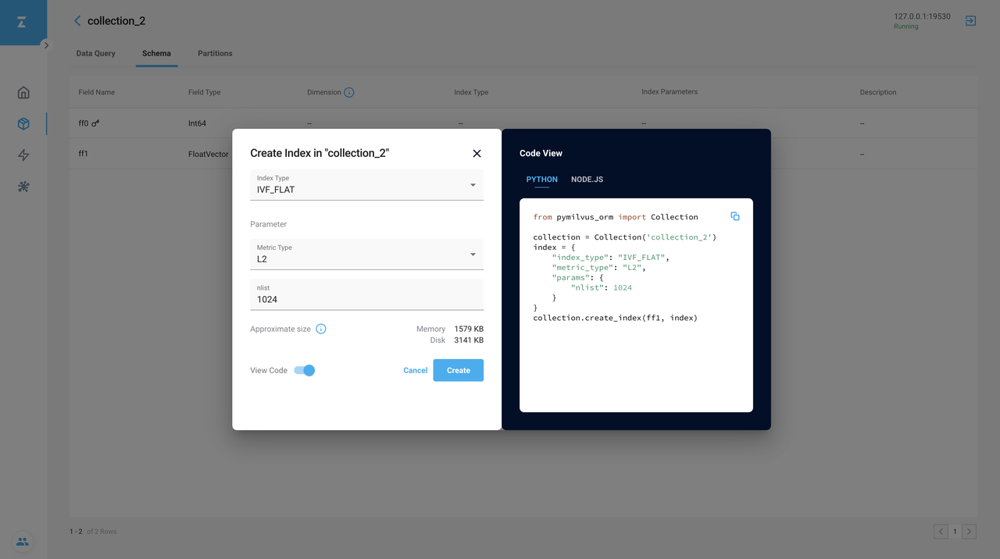
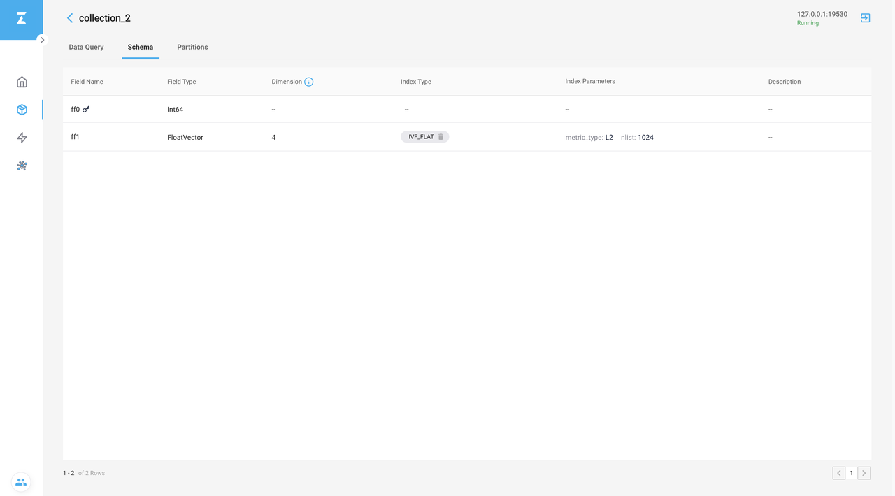

# 使用 Attu 管理索引

这片文章将会描述如何使用 Attu 管理索引。

## 创建索引

这个例子将会创建 IVF_FLAT 索引，使用 Euclidean 距离作为相似性度量，以及 `nlist` 值为 `1024`。

1. 在 **Collection** 页面，点击 **Schema** 页签。 然后在 **Schema** 页面，点击 **CREATE INDEX**，将会出现 **Create Index** 对话框。

2. 在 **Create Index** 对话框中，在 **Index Type** 下拉列表框中，选择 **IVF_FLAT**， 在 **Metric Type** 下拉列表框中，选择 **L2**，最后在 `nlist` 输入框中输入 `1024`。

3. 你可以点击 **View Code** 开关，将会看到 **Code View** 页面。你可以在这个页面中看到相应的 Python 或者 Node.js 代码。

4. 点击 **Create** 创建索引。

如果创建成功，你创建的索引类型将会出现在向量字段的 **Index Type** 列中。

## 删除索引

1. 点击 **Index Type** 列中的 **Trash** 图标，将会出现 **Delete Index** 对话框。
2. 输入 `delete` 来确认删除操作，然后点击 **Delete** 来删除索引。

如果删除成功，**CREATE INDEX** 按钮将会出现在 **Index Type** 列中。

