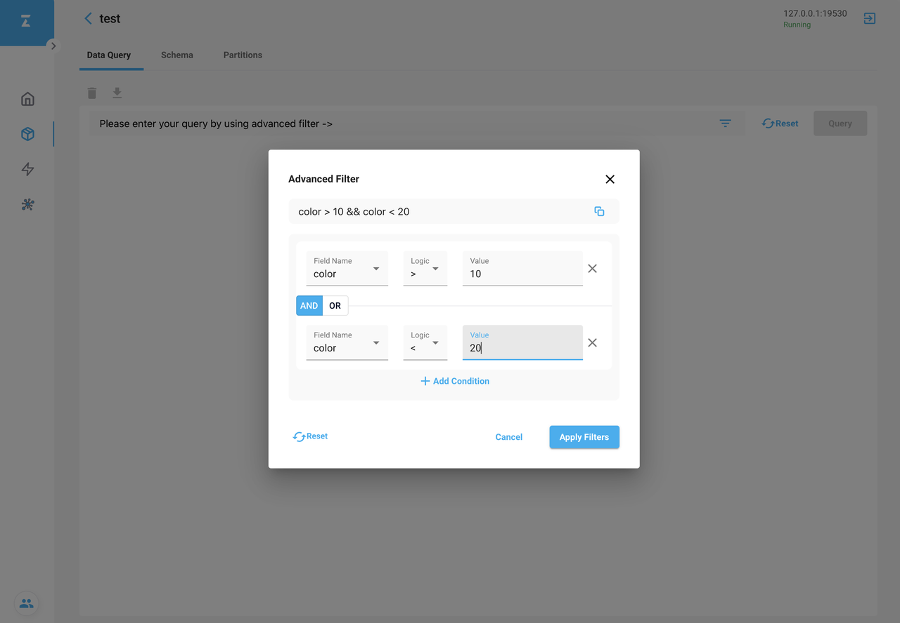
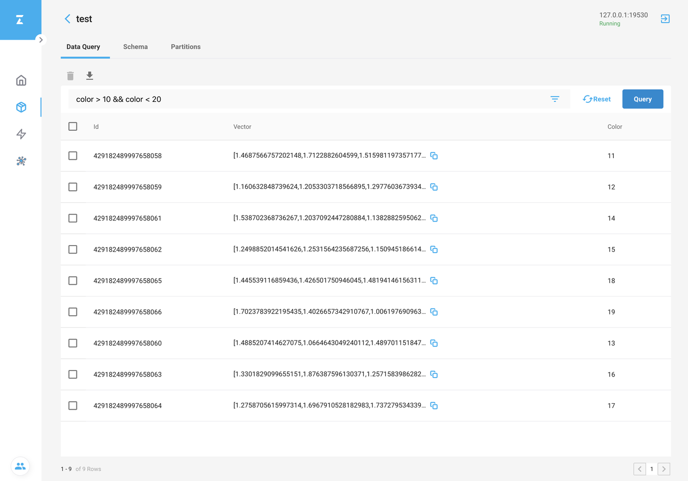
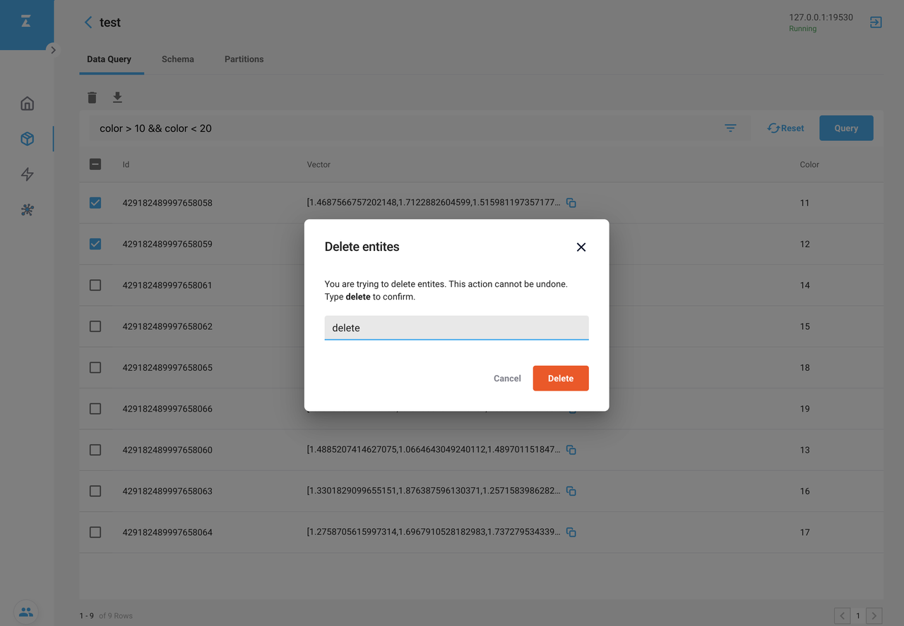
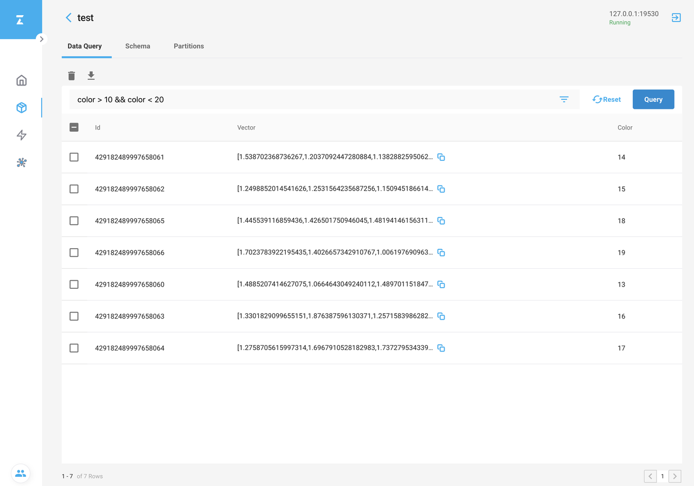

# 使用 Attu 获取数据

这个篇文章将描述 Attu 如何获取数据。

## 获取数据

1. 点击需要获取数据的 collection，就可以跳转到相应到详情页面。
2. 在 **Data Query** 页面，点击 **Filter** 标签，将会出现 **Advanced Filter** 对话框。
3. 通过表单，选择你需要的筛选条件，例如 **color > 10 && color < 20**。 点击 **Apply** 确认筛选条件。

1. 点击 **Query**，获取所有符合条件的数据。

## 删除数据

1. 选择需要删除的数据，然后点击 **Trash** 图标。
2. 在 **Delete entities** 对话框中，输入 `delete` 确认删除操作。
3. 点击 **Delete** 删除选中的数据。

删除成功后，通过 **Query** 获取已删除的数据，结果将不会包含已删除的数据。

