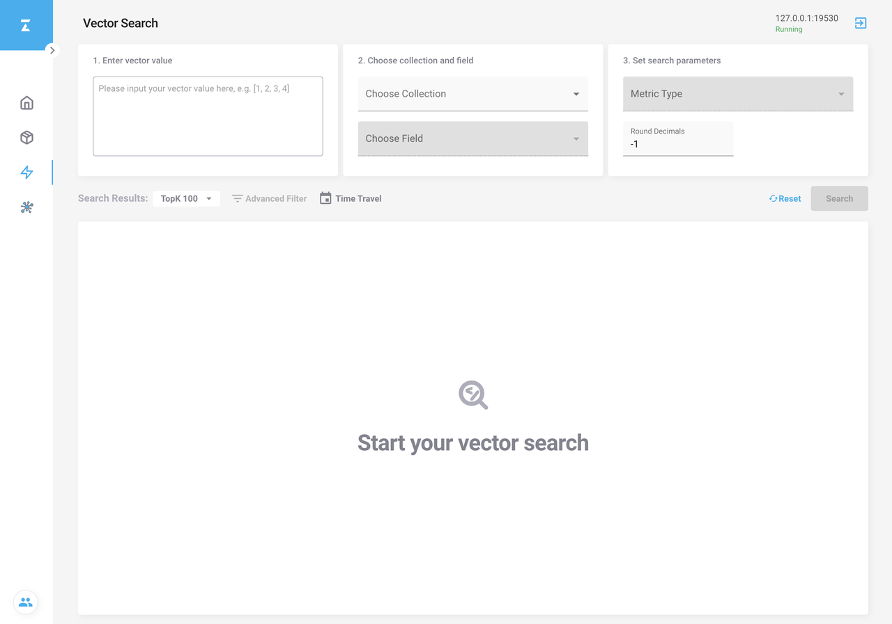
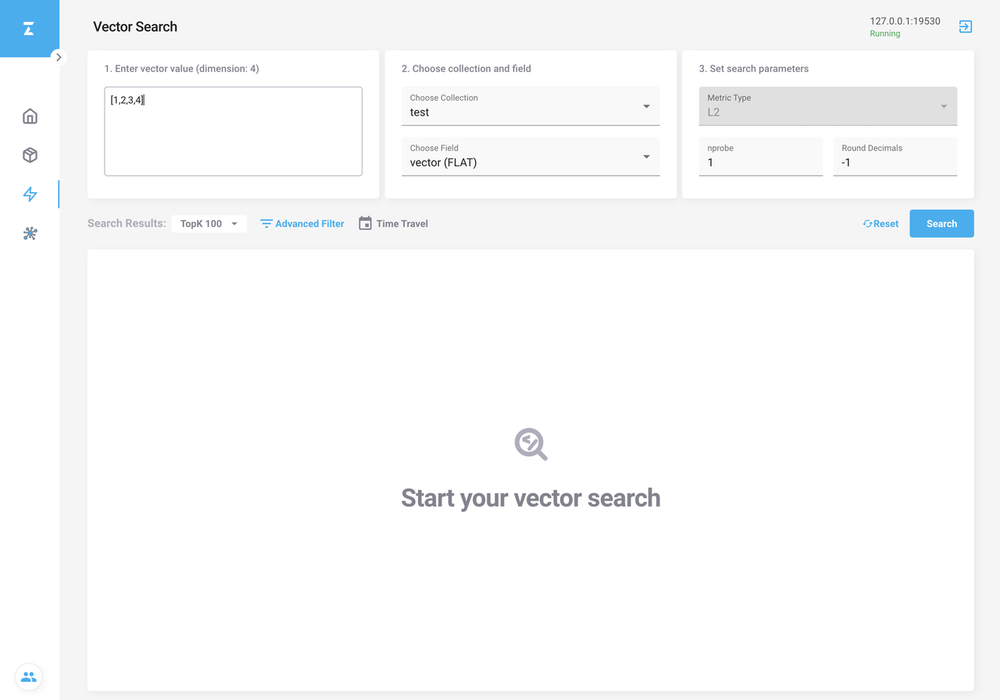
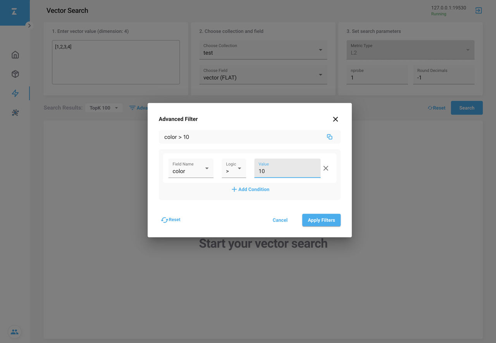
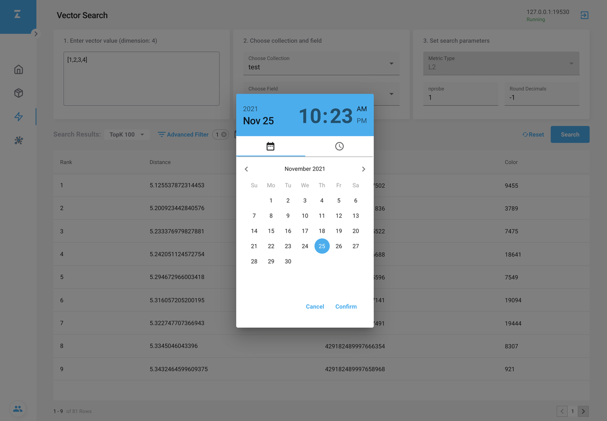
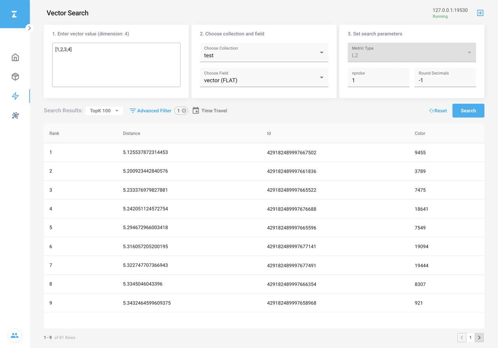
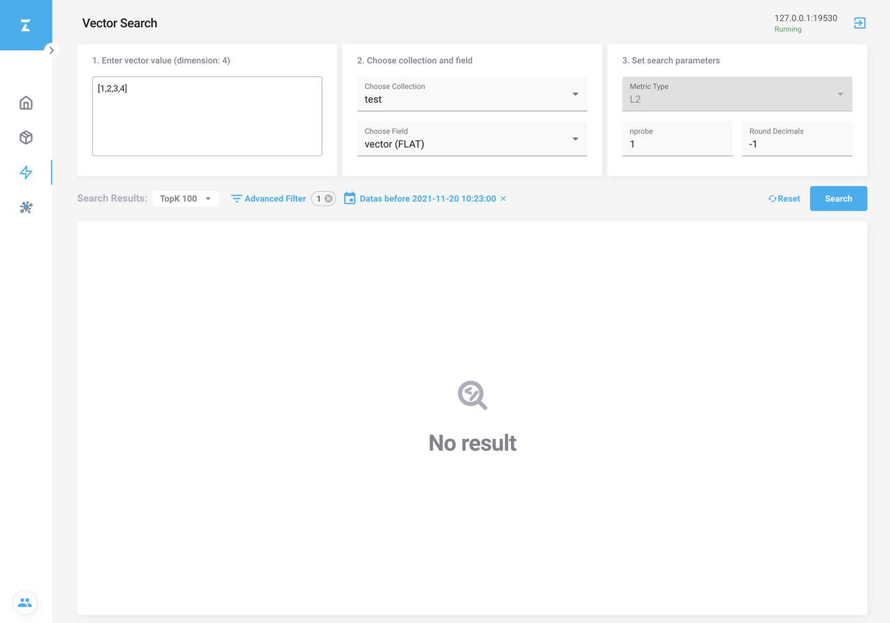

# 使用 Attu 进行向量搜索

这个篇文章将描述 Attu 如何进行向量搜索。

## 向量相似度搜索

在常规向量相似度搜索的基础上，还可以进行时间旅行搜索的混合搜索。

### 加载 collection 到缓存中

Milvus 内的所有 CRUD 操作都在内存中执行。在进行向量相似性搜索之前，需要将 collection 加载到内存中。查看[加载 collection](attu_collection.md#Load-a-collection) 了解更多。

### 设置搜索参数

1. 在 **Choose collection and field** 区域的下拉列表框中选择要搜索的 collection 和向量字段。
2. 在 **Enter vector value** 字段中，输入一个向量，其维度与要搜索的目标向量具有相同的所选字段维度。
3. 在 **Set search parameters** 区域，指定索引的特定参数和其他与搜索相关的参数。

### 带有高级过滤器的混合搜索（可选）

单击 **Advanced Filter**，将出现 **Advanced Filter** 对话框。您可以使用 **AND** 或 **OR** 运算符将多个条件组合成一个复合条件。过滤器表达式会随着条件的任何更改而自动更新。查看 [boolean expression rule](boolean.md) 了解更多。

### 时间旅行搜索（可选）

Milvus 为所有数据插入和删除操作维护一个时间线。它允许用户在向量搜索中，指定时间戳以检索指定时间点的数据视图。

1. 单击 **Time Travel**，然后在出现的对话框中选择一个时间点。

2. 在 **TopK** 下拉列表框中，指定要返回的搜索结果数。
3. 单击 **Search** 根据搜索条件检索最相似的向量。

